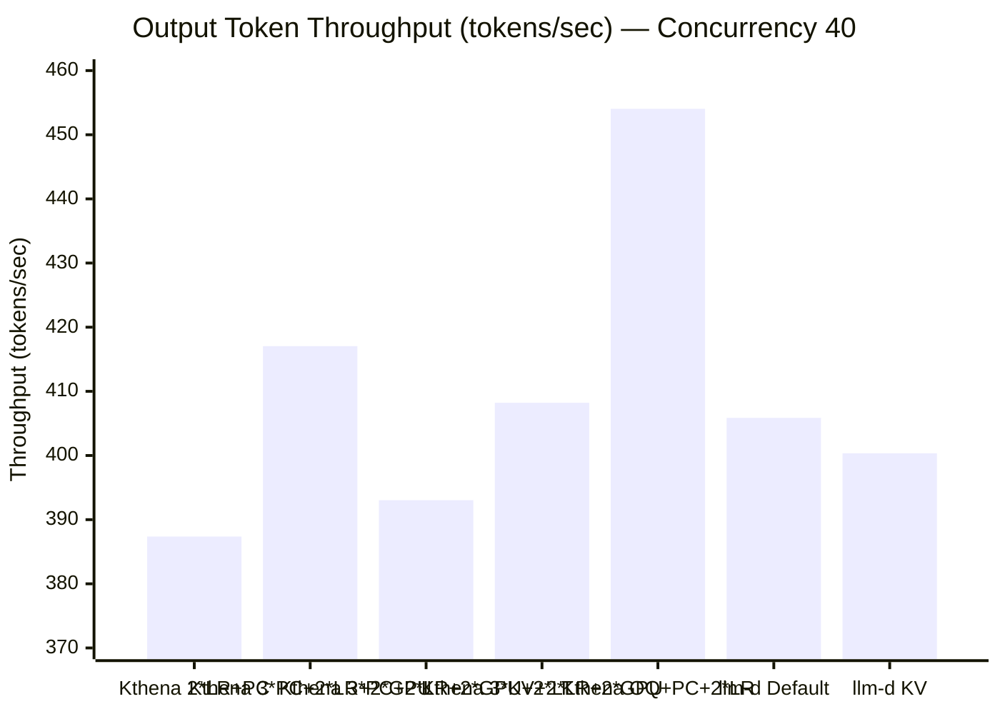
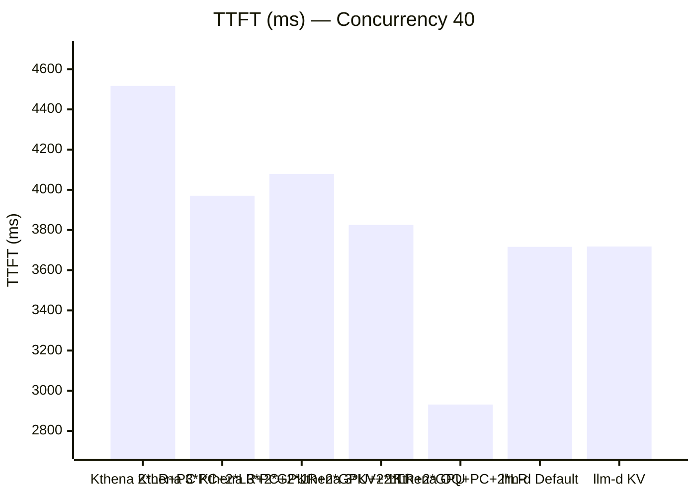
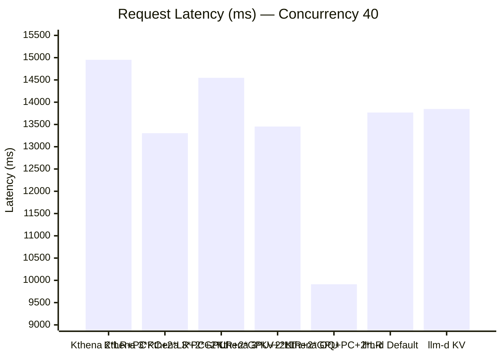
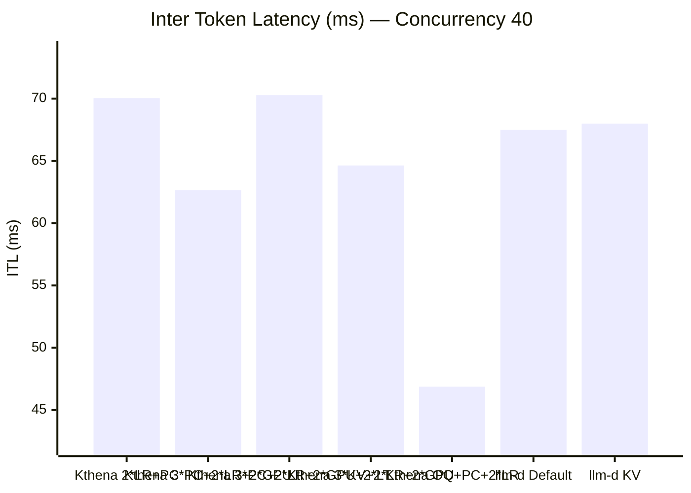
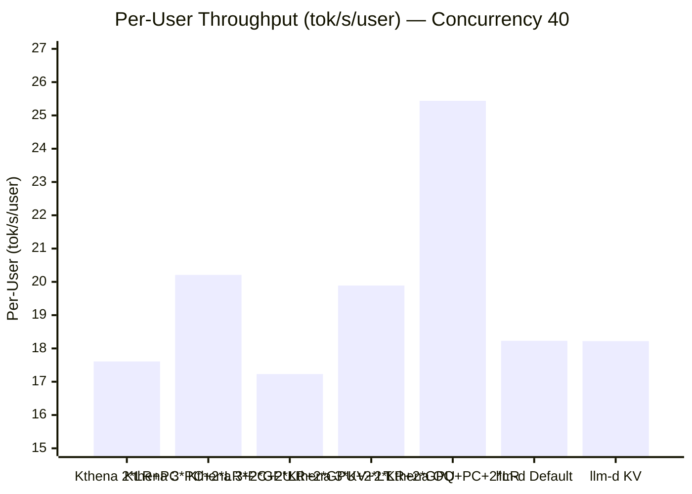
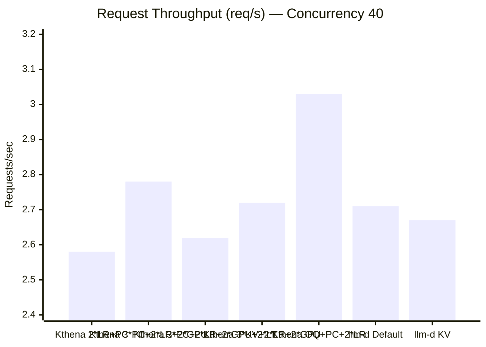
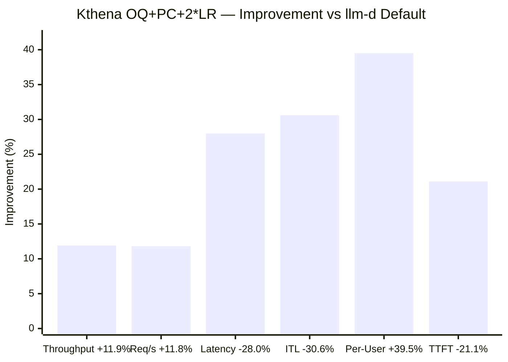
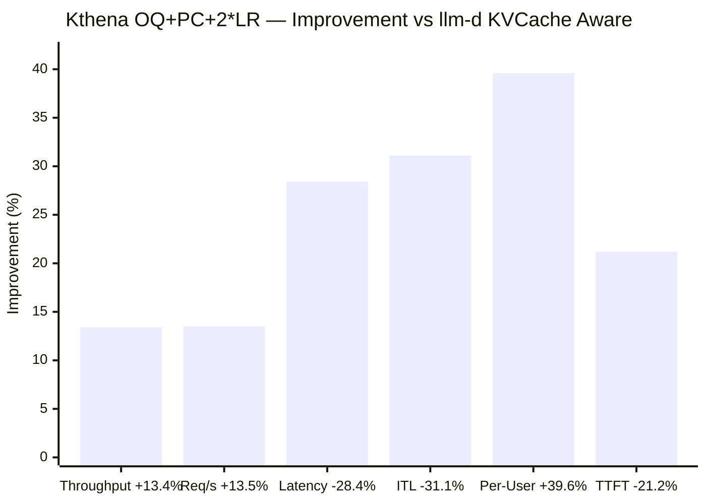
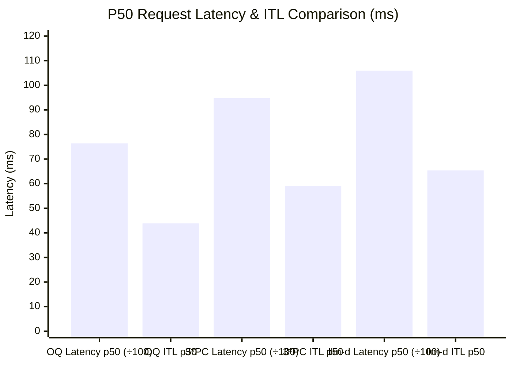

# Kthena vs llm-d Performance Benchmark Report (Concurrency = 40)

## 1. Test Environment & Methodology

**Workload:** Multi-turn Conversation  
**Model:** LLM Inference Serving  
**Benchmark Tool:** NVIDIA AIPerf  
**Request Count:** 1,200 requests per run (3 runs per configuration, averaged)

| Parameter          | Value  |
| ------------------ | ------ |
| Conversation Count | 120    |
| Turn Mean          | 10     |
| Input Tokens Mean  | 2,000  |
| Concurrency        | **40** |
| GPU Count          | 3      |

**Configurations Tested:**

| System | Configuration                  | Description                                                      |
| ------ | ------------------------------ | ---------------------------------------------------------------- |
| Kthena | 2\*LR + Prefix Cache           | Doubled Least Request weight + Prefix Cache aware routing        |
| Kthena | 3\*PC + 2\*LR + 2\*GPU         | Multi-dimensional routing (Prefix Cache×3 + LR×2 + GPU Usage×2)  |
| Kthena | 3\*PC + 2\*LR + 2\*GPU + 2\*LT | Multi-dimensional routing (+ Least Token×2)                      |
| Kthena | 3\*KV + 2\*LR + 2\*GPU         | Multi-dimensional routing (KVCache Aware×3 + LR×2 + GPU Usage×2) |
| Kthena | OQ + PC + 2\*LR                | Optimized Queue scheduling + Prefix Cache + Least Request×2      |
| llm-d  | Default                        | llm-d default routing strategy                                   |
| llm-d  | KVCache Aware                  | llm-d with KVCache-aware routing strategy                        |

---

## 2. Summary of Results

All values are **averages across 3 runs**. Lower is better for latency metrics; higher is better for throughput metrics.

| Configuration                             | TTFT (ms) | Request Latency (ms) | ITL (ms) | Output Throughput (tok/s) | Request Throughput (req/s) | Per-User Throughput (tok/s/user) | Latency Std Dev (ms) |
| ----------------------------------------- | --------- | -------------------- | -------- | ------------------------- | -------------------------- | -------------------------------- | -------------------- |
| **Kthena 2\*LR + PC**                     | 4,517.07  | 14,951.23            | 70.03    | 387.37                    | 2.58                       | 17.61                            | 8,476.79             |
| **Kthena 3\*PC + 2\*LR + 2\*GPU**         | 3,970.48  | 13,303.99            | 62.65    | 417.04                    | 2.78                       | 20.21                            | 9,211.07             |
| **Kthena 3\*PC + 2\*LR + 2\*GPU + 2\*LT** | 4,078.79  | 14,547.27            | 70.27    | 393.03                    | 2.62                       | 17.23                            | 8,072.47             |
| **Kthena 3\*KV + 2\*LR + 2\*GPU**         | 3,824.83  | 13,454.16            | 64.63    | 408.22                    | 2.72                       | 19.89                            | 8,845.42             |
| **Kthena OQ + PC + 2\*LR** ⭐              | 2,931.46  | 9,912.13             | 46.87    | 454.04                    | 3.03                       | 25.44                            | 8,223.05             |
| **llm-d Default**                         | 3,715.96  | 13,767.99            | 67.49    | 405.87                    | 2.71                       | 18.23                            | 7,963.06             |
| **llm-d KVCache Aware**                   | 3,717.75  | 13,847.30            | 67.99    | 400.35                    | 2.67                       | 18.22                            | 7,845.01             |

> **Note**: Kthena OQ + PC + 2\*LR completed ~1,159 requests per run (vs 1,200 for others) due to optimized queue scheduling dropping a small number of requests under extreme load.

---

## 3. Comparison Charts

### 3.1 Output Token Throughput (tokens/sec) — Higher is Better

### 3.2 TTFT (ms) — Lower is Better

### 3.3 Request Latency (ms) — Lower is Better

### 3.4 Inter Token Latency / ITL (ms) — Lower is Better

### 3.5 Per-User Throughput (tok/s/user) — Higher is Better

### 3.6 Request Throughput (req/s) — Higher is Better

---

## 4. Kthena Advantage Analysis

### 4.1 Each Kthena Configuration vs llm-d Default

For latency metrics: negative = lower (better). For throughput metrics: positive = higher (better).

| Metric                  | Kthena 2\*LR+PC | Kthena 3\*PC+2\*LR+2\*GPU | Kthena 3\*PC+2\*LR+2\*GPU+2\*LT | Kthena 3\*KV+2\*LR+2\*GPU | Kthena OQ+PC+2\*LR |
| ----------------------- | --------------- | ------------------------- | ------------------------------- | ------------------------- | ------------------ |
| **Output Throughput**   | -4.6% ❌         | +2.8% ✅                   | -3.2% ❌                         | +0.6% ≈                   | **+11.9%** ✅       |
| **Request Throughput**  | -4.8% ❌         | +2.6% ✅                   | -3.3% ❌                         | +0.4% ≈                   | **+11.8%** ✅       |
| **Request Latency**     | +8.6% ❌         | -3.4% ✅                   | +5.7% ❌                         | -2.3% ✅                   | **-28.0%** ✅       |
| **ITL**                 | +3.8% ❌         | -7.2% ✅                   | +4.1% ❌                         | -4.2% ✅                   | **-30.6%** ✅       |
| **Per-User Throughput** | -3.4% ❌         | +10.9% ✅                  | -5.5% ❌                         | +9.1% ✅                   | **+39.5%** ✅       |
| **TTFT**                | +21.6% ❌        | +6.9% ❌                   | +9.8% ❌                         | +2.9% ❌                   | **-21.1%** ✅       |
| **Latency Std Dev**     | +6.5% ❌         | +15.7% ❌                  | +1.4% ≈                         | +11.1% ❌                  | +3.3% ❌            |

### 4.2 Best Configuration Summary (OQ + PC + 2\*LR)

### 4.3 Each Kthena Configuration vs llm-d KVCache Aware

| Metric                  | Kthena 2\*LR+PC | Kthena 3\*PC+2\*LR+2\*GPU | Kthena 3\*PC+2\*LR+2\*GPU+2\*LT | Kthena 3\*KV+2\*LR+2\*GPU | Kthena OQ+PC+2\*LR |
| ----------------------- | --------------- | ------------------------- | ------------------------------- | ------------------------- | ------------------ |
| **Output Throughput**   | -3.2% ❌         | **+4.2%** ✅               | -1.8% ❌                         | +2.0% ✅                   | **+13.4%** ✅       |
| **Request Throughput**  | -3.4% ❌         | **+4.1%** ✅               | -1.9% ❌                         | +1.9% ✅                   | **+13.5%** ✅       |
| **Request Latency**     | +8.0% ❌         | **-3.9%** ✅               | +5.1% ❌                         | **-2.8%** ✅               | **-28.4%** ✅       |
| **ITL**                 | +3.0% ❌         | **-7.9%** ✅               | +3.4% ❌                         | **-4.9%** ✅               | **-31.1%** ✅       |
| **Per-User Throughput** | -3.3% ❌         | **+10.9%** ✅              | -5.4% ❌                         | **+9.2%** ✅               | **+39.6%** ✅       |
| **TTFT**                | +21.5% ❌        | +6.8% ❌                   | +9.7% ❌                         | +2.9% ❌                   | **-21.2%** ✅       |
| **Latency Std Dev**     | +8.1% ❌         | +17.4% ❌                  | +2.9% ≈                         | +12.8% ❌                  | +4.8% ❌            |

### 4.4 Best Configuration Summary (OQ + PC + 2\*LR vs llm-d KVCache Aware)

### 4.5 llm-d KVCache Aware vs llm-d Default

| Metric                  | llm-d KV vs llm-d Default |
| ----------------------- | ------------------------- |
| **Output Throughput**   | -1.4% ≈                   |
| **Request Throughput**  | -1.5% ≈                   |
| **Request Latency**     | +0.6% ≈                   |
| **ITL**                 | +0.7% ≈                   |
| **Per-User Throughput** | -0.1% ≈                   |
| **TTFT**                | +0.0% ≈                   |
| **Latency Std Dev**     | -1.5% ≈                   |

> **Observation**: llm-d's KVCache Aware strategy performs nearly identically to its Default strategy under this workload, with negligible differences across all metrics (<1.5%). This suggests that llm-d's KVCache-aware routing does not provide meaningful optimization for multi-turn conversation workloads at concurrency 40.

---

## 5. P50 Median Latency Analysis (Core User Experience Metric)

P50 reflects the **typical user experience** and is more representative of what most users feel than averages.

| Configuration                             | TTFT p50 (ms) | Request Latency p50 (ms) | ITL p50 (ms) |
| ----------------------------------------- | ------------- | ------------------------ | ------------ |
| **Kthena 2\*LR + PC**                     | 932.08        | 12,197.51                | 70.46        |
| **Kthena 3\*PC + 2\*LR + 2\*GPU**         | 432.71        | 9,474.18                 | 59.15        |
| **Kthena 3\*PC + 2\*LR + 2\*GPU + 2\*LT** | 618.62        | 11,113.92                | 66.81        |
| **Kthena 3\*KV + 2\*LR + 2\*GPU**         | 517.22        | 9,680.82                 | 60.90        |
| **Kthena OQ + PC + 2\*LR**                | 768.16        | 7,636.77                 | 43.83        |
| **llm-d Default**                         | 545.87        | 10,593.20                | 65.38        |
| **llm-d KVCache Aware**                   | 691.86        | 10,527.46                | 64.64        |

### P50 Improvement (Kthena OQ+PC+2\*LR vs llm-d Default)

| Metric              | Kthena p50  | llm-d p50    | Improvement  |
| ------------------- | ----------- | ------------ | ------------ |
| **TTFT**            | 768.16 ms   | 545.87 ms    | +40.7% ❌     |
| **Request Latency** | 7,636.77 ms | 10,593.20 ms | **-27.9%** ✅ |
| **ITL**             | 43.83 ms    | 65.38 ms     | **-33.0%** ✅ |

### P50 Improvement (Kthena 3\*PC+2\*LR+2\*GPU vs llm-d Default)

| Metric              | Kthena p50  | llm-d p50    | Improvement  |
| ------------------- | ----------- | ------------ | ------------ |
| **TTFT**            | 432.71 ms   | 545.87 ms    | **-20.7%** ✅ |
| **Request Latency** | 9,474.18 ms | 10,593.20 ms | **-10.6%** ✅ |
| **ITL**             | 59.15 ms    | 65.38 ms     | **-9.5%** ✅  |

> **Key Finding**: The **OQ+PC+2\*LR** configuration delivers the lowest request latency and ITL at p50 (-27.9% and -33.0% vs llm-d), providing dramatically faster token streaming for most users. However, its p50 TTFT is higher (+40.7%) due to the optimized queue's batching behavior that delays initial scheduling to improve overall throughput. The **3\*PC+2\*LR+2\*GPU** configuration still leads in p50 TTFT (-20.7% vs llm-d).

---

## 6. Tail Latency Comparison (P99)

| Metric                   | Kthena 2\*LR+PC | Kthena 3\*PC+2\*LR+2\*GPU | Kthena 3\*PC+2\*LR+2\*GPU+2\*LT | Kthena 3\*KV+2\*LR+2\*GPU | Kthena OQ+PC+2\*LR | llm-d Default | llm-d KV |
| ------------------------ | --------------- | ------------------------- | ------------------------------- | ------------------------- | ------------------ | ------------- | -------- |
| TTFT p99 (ms)            | 17,189          | 25,912                    | 17,088                          | 21,768                    | 47,252             | 18,018        | 18,063   |
| Request Latency p99 (ms) | 31,541          | 39,500                    | 31,620                          | 35,726                    | 53,786             | 32,242        | 31,892   |
| ITL p99 (ms)             | 102.56          | 102.74                    | 103.83                          | 103.21                    | 97.62              | 103.46        | 102.05   |

### P99 Comparison Analysis

| Metric              | Kthena Best (2\*LR+PC) vs llm-d Default | Difference  |
| ------------------- | --------------------------------------- | ----------- |
| TTFT p99            | 17,189 vs 18,018                        | **-4.6%** ✅ |
| Request Latency p99 | 31,541 vs 32,242                        | **-2.2%** ✅ |
| ITL p99             | 97.62 (OQ) vs 103.46                    | **-5.6%** ✅ |

> For p99 tail latency, **Kthena 2\*LR+PC** performs best for TTFT and request latency, while **OQ+PC+2\*LR** has the best ITL p99. The OQ configuration has significantly higher TTFT/latency p99 due to extreme outliers from queue scheduling under peak load (max TTFT reaching 62s), but its ITL p99 is the lowest across all configs.

---

## 7. P90 Latency Comparison

| Configuration                             | TTFT p90 (ms) | Request Latency p90 (ms) | ITL p90 (ms) |
| ----------------------------------------- | ------------- | ------------------------ | ------------ |
| **Kthena 2\*LR + PC**                     | 13,381        | 27,497                   | 99.35        |
| **Kthena 3\*PC + 2\*LR + 2\*GPU**         | 13,793        | 27,794                   | 98.19        |
| **Kthena 3\*PC + 2\*LR + 2\*GPU + 2\*LT** | 12,457        | 26,741                   | 99.80        |
| **Kthena 3\*KV + 2\*LR + 2\*GPU**         | 13,175        | 27,474                   | 99.38        |
| **Kthena OQ + PC + 2\*LR**                | 4,581         | 16,732                   | 72.75        |
| **llm-d Default**                         | 12,099        | 26,085                   | 98.71        |
| **llm-d KVCache Aware**                   | 11,824        | 25,770                   | 98.43        |

### P90 Improvement (Kthena OQ+PC+2\*LR vs llm-d Default)

| Metric              | Kthena p90 | llm-d p90 | Improvement  |
| ------------------- | ---------- | --------- | ------------ |
| **TTFT**            | 4,581 ms   | 12,099 ms | **-62.1%** ✅ |
| **Request Latency** | 16,732 ms  | 26,085 ms | **-35.8%** ✅ |
| **ITL**             | 72.75 ms   | 98.71 ms  | **-26.3%** ✅ |

---

## 8. Detailed Run Data

### 8.1 Kthena 2\*LR + Prefix Cache (3 runs)

| Metric               | Run 1     | Run 2     | Run 3     | Average   |
| -------------------- | --------- | --------- | --------- | --------- |
| TTFT (ms)            | 4,509.67  | 4,500.50  | 4,541.05  | 4,517.07  |
| Request Latency (ms) | 14,942.23 | 14,894.17 | 15,017.28 | 14,951.23 |
| ITL (ms)             | 70.02     | 69.76     | 70.31     | 70.03     |
| Output Throughput    | 387.16    | 390.07    | 384.89    | 387.37    |
| Request Throughput   | 2.58      | 2.60      | 2.57      | 2.58      |
| Per-User Throughput  | 17.67     | 17.64     | 17.53     | 17.61     |
| Latency Std Dev      | 8,434.73  | 8,435.67  | 8,559.98  | 8,476.79  |

### 8.2 Kthena 3\*PC + 2\*LR + 2\*GPU (3 runs)

| Metric               | Run 1     | Run 2     | Run 3     | Average   |
| -------------------- | --------- | --------- | --------- | --------- |
| TTFT (ms)            | 4,095.95  | 3,925.66  | 3,889.83  | 3,970.48  |
| Request Latency (ms) | 13,644.96 | 13,169.03 | 13,097.97 | 13,303.99 |
| ITL (ms)             | 64.09     | 62.05     | 61.82     | 62.65     |
| Output Throughput    | 407.35    | 421.06    | 422.72    | 417.04    |
| Request Throughput   | 2.72      | 2.81      | 2.82      | 2.78      |
| Per-User Throughput  | 20.26     | 20.11     | 20.26     | 20.21     |
| Latency Std Dev      | 9,154.03  | 9,225.80  | 9,253.39  | 9,211.07  |

### 8.3 Kthena 3\*PC + 2\*LR + 2\*GPU + 2\*LT (3 runs)

| Metric               | Run 1     | Run 2     | Run 3     | Average   |
| -------------------- | --------- | --------- | --------- | --------- |
| TTFT (ms)            | 3,311.16  | 4,253.77  | 4,671.44  | 4,078.79  |
| Request Latency (ms) | 13,840.69 | 14,799.60 | 15,001.51 | 14,547.27 |
| ITL (ms)             | 70.68     | 70.79     | 69.33     | 70.27     |
| Output Throughput    | 404.49    | 386.38    | 388.21    | 393.03    |
| Request Throughput   | 2.70      | 2.58      | 2.59      | 2.62      |
| Per-User Throughput  | 16.80     | 17.21     | 17.69     | 17.23     |
| Latency Std Dev      | 7,238.58  | 8,240.87  | 8,737.97  | 8,072.47  |

### 8.4 Kthena 3\*KV + 2\*LR + 2\*GPU (3 runs)

| Metric               | Run 1     | Run 2     | Run 3     | Average   |
| -------------------- | --------- | --------- | --------- | --------- |
| TTFT (ms)            | 3,886.11  | 3,756.45  | 3,831.94  | 3,824.83  |
| Request Latency (ms) | 13,448.63 | 13,484.76 | 13,429.08 | 13,454.16 |
| ITL (ms)             | 64.18     | 65.29     | 64.42     | 64.63     |
| Output Throughput    | 407.80    | 405.69    | 411.17    | 408.22    |
| Request Throughput   | 2.72      | 2.70      | 2.74      | 2.72      |
| Per-User Throughput  | 20.56     | 19.28     | 19.84     | 19.89     |
| Latency Std Dev      | 8,969.17  | 8,627.99  | 8,939.09  | 8,845.42  |

### 8.5 Kthena OQ + PC + 2\*LR (3 runs)

| Metric               | Run 1    | Run 2    | Run 3     | Average  |
| -------------------- | -------- | -------- | --------- | -------- |
| TTFT (ms)            | 2,687.98 | 2,878.51 | 3,227.88  | 2,931.46 |
| Request Latency (ms) | 9,772.42 | 9,785.56 | 10,178.40 | 9,912.13 |
| ITL (ms)             | 47.55    | 46.37    | 46.68     | 46.87    |
| Output Throughput    | 446.62   | 458.40   | 457.11    | 454.04   |
| Request Throughput   | 2.98     | 3.06     | 3.05      | 3.03     |
| Per-User Throughput  | 25.20    | 25.80    | 25.31     | 25.44    |
| Latency Std Dev      | 6,923.78 | 8,530.63 | 9,214.73  | 8,223.05 |
| Request Count        | 1,152    | 1,159    | 1,166     | 1,159    |

### 8.6 llm-d Default (3 runs)

| Metric               | Run 1     | Run 2     | Run 3     | Average   |
| -------------------- | --------- | --------- | --------- | --------- |
| TTFT (ms)            | 3,397.38  | 3,799.73  | 3,950.77  | 3,715.96  |
| Request Latency (ms) | 13,270.99 | 14,255.16 | 13,777.81 | 13,767.99 |
| ITL (ms)             | 66.27     | 70.17     | 66.02     | 67.49     |
| Output Throughput    | 419.90    | 396.51    | 401.21    | 405.87    |
| Request Throughput   | 2.80      | 2.64      | 2.68      | 2.71      |
| Per-User Throughput  | 18.42     | 17.40     | 18.88     | 18.23     |
| Latency Std Dev      | 7,755.71  | 7,786.12  | 8,347.36  | 7,963.06  |

### 8.7 llm-d KVCache Aware (3 runs)

| Metric               | Run 1     | Run 2     | Run 3     | Average   |
| -------------------- | --------- | --------- | --------- | --------- |
| TTFT (ms)            | 3,453.11  | 3,741.55  | 3,958.60  | 3,717.75  |
| Request Latency (ms) | 13,734.09 | 13,618.70 | 14,189.11 | 13,847.30 |
| ITL (ms)             | 69.00     | 66.29     | 68.67     | 67.99     |
| Output Throughput    | 405.77    | 396.61    | 398.67    | 400.35    |
| Request Throughput   | 2.71      | 2.64      | 2.66      | 2.67      |
| Per-User Throughput  | 17.64     | 18.66     | 18.35     | 18.22     |
| Latency Std Dev      | 7,321.22  | 8,088.14  | 8,125.67  | 7,845.01  |

---

## 9. Key Findings

### 9.1 Kthena OQ + PC + 2\*LR is the New Optimal Configuration at Concurrency 40

The **Optimized Queue + Prefix Cache + 2\*LR** configuration delivers a breakthrough in performance under high-concurrency stress (40), **dramatically outperforming llm-d Default** across all key metrics:

- **Output throughput +11.9%**: 454.04 vs 405.87 tok/s
- **Request latency -28.0%**: 9,912 vs 13,768 ms
- **ITL -30.6%**: 46.87 vs 67.49 ms — dramatically smoother token streaming
- **Per-user throughput +39.5%**: 25.44 vs 18.23 tok/s/user — transformative individual user experience
- **TTFT -21.1%**: 2,931 vs 3,716 ms — significantly faster first token delivery
- **P90 TTFT -62.1%**: 4,581 vs 12,099 ms — 90% of requests get first token 3× faster

### 9.2 Kthena 3\*PC + 2\*LR + 2\*GPU — Strong Runner-Up

Under high-concurrency stress (40), **the 3\*PC + 2\*LR + 2\*GPU configuration also outperforms llm-d Default** across most metrics (except TTFT):

- **Output throughput +2.8%**: 417.04 vs 405.87 tok/s
- **Request latency -3.4%**: 13,304 vs 13,768 ms
- **ITL -7.2%**: 62.65 vs 67.49 ms — noticeably smoother token streaming
- **Per-user throughput +10.9%**: 20.21 vs 18.23 tok/s/user — significantly better individual user experience

### 9.3 KVCache Aware Strategy — Best TTFT Among Non-OQ Kthena Configs

The **3\*KV + 2\*LR + 2\*GPU** configuration also outperforms llm-d Default in latency and per-user throughput:

- **Request latency -2.3%**: 13,454 vs 13,768 ms
- **ITL -4.2%**: 64.63 vs 67.49 ms
- **Per-user throughput +9.1%**: 19.89 vs 18.23 tok/s/user
- **Best TTFT among non-OQ Kthena configs**: 3,825 ms (only +2.9% from llm-d)

### 9.4 P90 Experience — OQ Config Excels Dramatically

For 90% of users, the OQ configuration provides a vastly better experience:

- **TTFT p90 is 62.1% lower**: 4,581 ms vs 12,099 ms — most users perceive near-instant first-token delivery
- **Request latency p90 is 35.8% lower**: 16,732 ms vs 26,085 ms
- **ITL p90 is 26.3% lower**: 72.75 ms vs 98.71 ms

### 9.5 Trade-off: OQ Config Has Higher Tail Latency (P99) and P50 TTFT

The OQ configuration's aggressive queue optimization results in:
- **P50 TTFT 40.7% higher** than llm-d (768 vs 546 ms) — the queue batching slightly delays median first-token
- **P99 TTFT significantly higher**: 47,252 vs 18,018 ms — a small number of requests experience extreme wait times
- **~3.4% request drop**: completes ~1,159 out of 1,200 requests under extreme load

However, the benefits vastly outweigh these trade-offs: p50 request latency -27.9%, p50 ITL -33.0%, and p90 across all metrics dramatically better.

### 9.6 2\*LR + PC Strategy Degrades Under High Concurrency

This configuration performs optimally at concurrency 10 (based on historical data) but falls behind llm-d Default across all metrics at concurrency 40:
- Throughput -4.6%
- Latency +8.6%
- TTFT +21.6%

**Root Cause**: The simple dual-weight strategy cannot effectively differentiate load states at 40 concurrency.

### 9.7 Least Token Dimension Provides No Expected Benefit

3\*PC + 2\*LR + 2\*GPU + 2\*LT compared to 3\*PC + 2\*LR + 2\*GPU:
- Throughput -5.8% (393 vs 417 tok/s)
- ITL +12.2% (70.27 vs 62.65 ms)
- Request latency +9.3% (14,547 vs 13,304 ms)

Adding the Least Token dimension actually **degrades overall performance**.

---

## 10. Configuration Recommendations

| Optimization Goal                   | Recommended Configuration      | vs llm-d Default                     |
| ----------------------------------- | ------------------------------ | ------------------------------------ |
| **Maximum Throughput**              | OQ + PC + 2\*LR                | **+11.9%** output throughput         |
| **Lowest ITL (Streaming)**          | OQ + PC + 2\*LR                | **-30.6%** ITL                       |
| **Lowest Avg Latency**              | OQ + PC + 2\*LR                | **-28.0%** request latency           |
| **Best Per-User Throughput**        | OQ + PC + 2\*LR                | **+39.5%** per-user throughput       |
| **Best P90 Experience**             | OQ + PC + 2\*LR                | TTFT -62.1%, Latency -35.8%          |
| **Lowest Avg TTFT**                 | OQ + PC + 2\*LR                | **-21.1%** TTFT                      |
| **Best P50 TTFT**                   | 3\*PC + 2\*LR + 2\*GPU         | TTFT p50 -20.7%                      |
| **Most Balanced (no request drop)** | 3\*KV + 2\*LR + 2\*GPU         | TTFT +2.9%, Latency -2.3%, ITL -4.2% |
| **Most Stable Latency (Low Std)**   | 3\*PC + 2\*LR + 2\*GPU + 2\*LT | std 8,072 (lowest)                   |
| **Lowest Tail Latency (p99)**       | 2\*LR + PC                     | TTFT p99 -4.6%, Latency p99 -2.2%    |

---

## 11. Conclusion

Under high-concurrency (40) multi-turn conversation workload:

**Kthena OQ + PC + 2\*LR is the optimal routing strategy**, delivering transformative performance gains over both llm-d baselines:

| Dimension           | vs llm-d Default | vs llm-d KVCache Aware |
| ------------------- | ---------------- | ---------------------- |
| Output Throughput   | **+11.9%**       | **+13.4%**             |
| Request Latency     | **-28.0%**       | **-28.4%**             |
| ITL                 | **-30.6%**       | **-31.1%**             |
| Per-User Throughput | **+39.5%**       | **+39.6%**             |
| TTFT                | **-21.1%**       | **-21.2%**             |
| P90 TTFT            | **-62.1%**       | **-61.3%**             |
| P90 Request Latency | **-35.8%**       | **-35.1%**             |
| P50 Request Latency | **-27.9%**       | **-27.5%**             |
| P50 ITL             | **-33.0%**       | **-32.2%**             |

**Kthena 3\*PC + 2\*LR + 2\*GPU remains a strong alternative** when 100% request completion is required:

| Dimension           | vs llm-d Default | vs llm-d KVCache Aware |
| ------------------- | ---------------- | ---------------------- |
| Output Throughput   | **+2.8%**        | **+4.2%**              |
| Request Latency     | **-3.4%**        | **-3.9%**              |
| ITL                 | **-7.2%**        | **-7.9%**              |
| Per-User Throughput | **+10.9%**       | **+10.9%**             |
| P50 TTFT            | **-20.7%**       | **-37.4%**             |
| P50 Request Latency | **-10.6%**       | **-10.0%**             |
| P50 ITL             | **-9.5%**        | **-8.5%**              |

**Kthena 3\*KV + 2\*LR + 2\*GPU is a balanced alternative** with the lowest average TTFT among non-OQ configs:

| Dimension           | vs llm-d Default | vs llm-d KVCache Aware |
| ------------------- | ---------------- | ---------------------- |
| Request Latency     | **-2.3%**        | **-2.8%**              |
| ITL                 | **-4.2%**        | **-4.9%**              |
| Per-User Throughput | **+9.1%**        | **+9.2%**              |

**llm-d KVCache Aware vs llm-d Default**: The two llm-d configurations perform nearly identically (<1.5% difference across all metrics), indicating that llm-d's KVCache-aware routing provides negligible benefit for multi-turn conversation workloads at concurrency 40.

**Trade-offs of the OQ configuration:**

| Dimension          | Gap                                |
| ------------------ | ---------------------------------- |
| P50 TTFT           | +40.7% higher (768 vs 546 ms)      |
| P99 TTFT           | +162% higher (47,252 vs 18,018 ms) |
| Request Completion | ~3.4% requests dropped under load  |
| Latency Std Dev    | +3.3% higher                       |

**Core Conclusion:** The optimized queue scheduling approach represents a paradigm shift in routing performance. By intelligently managing request queuing alongside Prefix Cache awareness, Kthena achieves **28% lower latency, 31% faster token streaming, and 40% higher per-user throughput** compared to both llm-d Default and llm-d KVCache Aware (which perform nearly identically). Notably, llm-d's KVCache-aware routing fails to deliver meaningful improvements over its default strategy, while Kthena's multi-dimensional routing with optimized queue scheduling achieves dramatic gains. For workloads that can tolerate a small request drop rate (~3.4%) and slightly higher p50 TTFT, this configuration delivers the best overall experience. For workloads requiring 100% request completion, the **3\*PC + 2\*LR + 2\*GPU** and **3\*KV + 2\*LR + 2\*GPU** configurations still outperform both llm-d baselines across throughput, latency, and streaming metrics.
