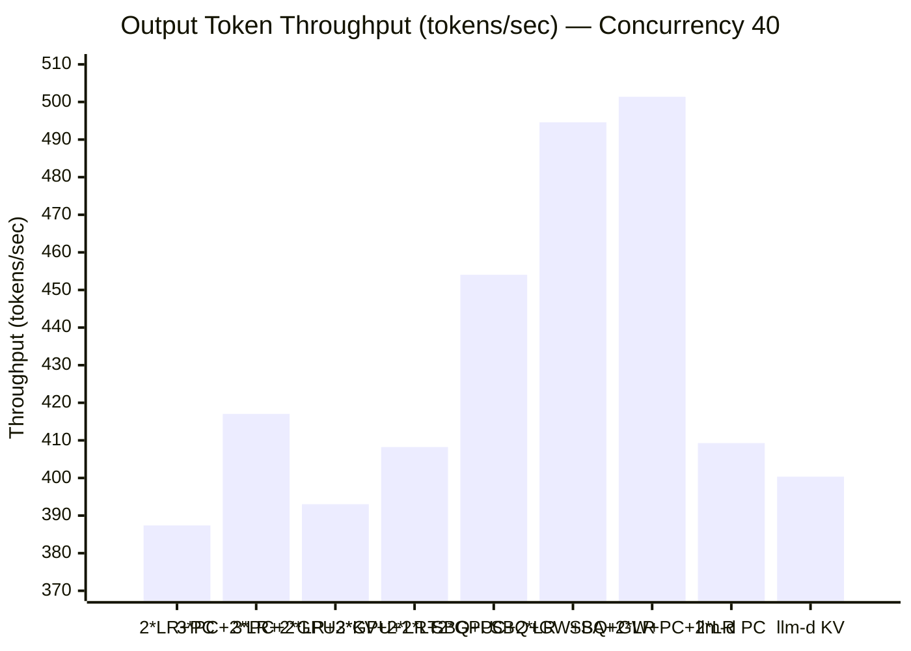
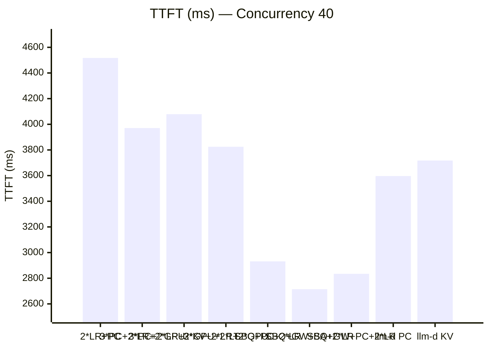
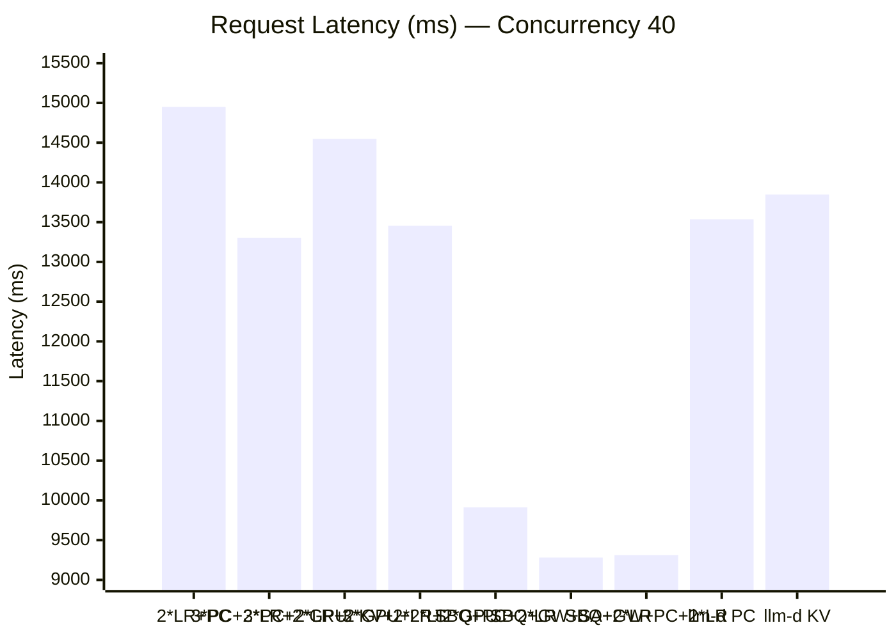
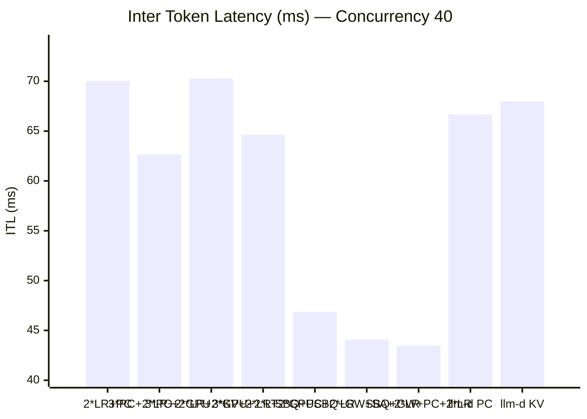
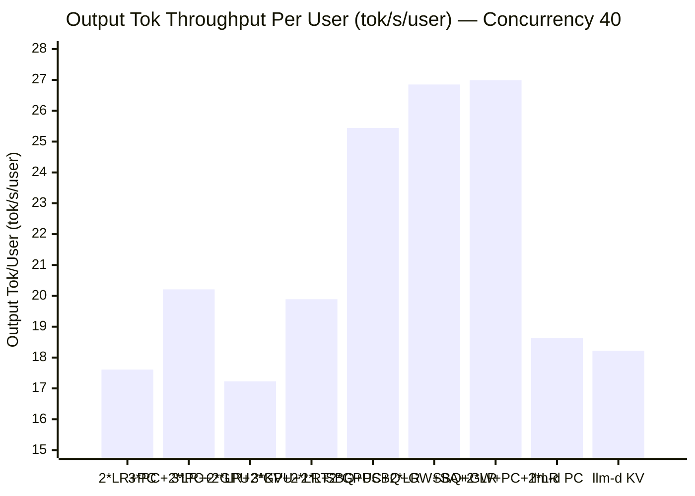
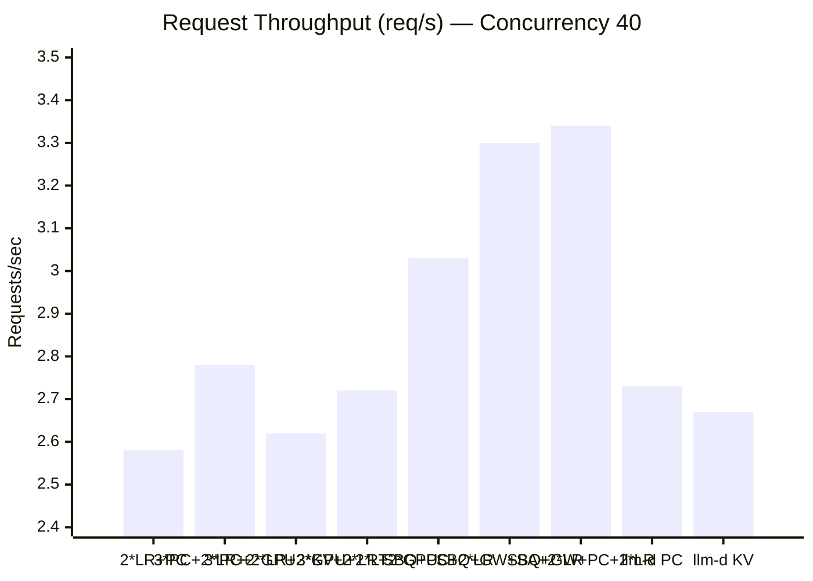
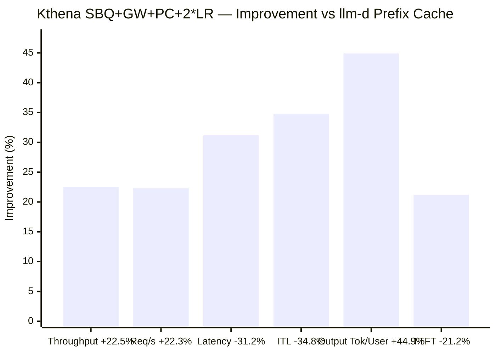
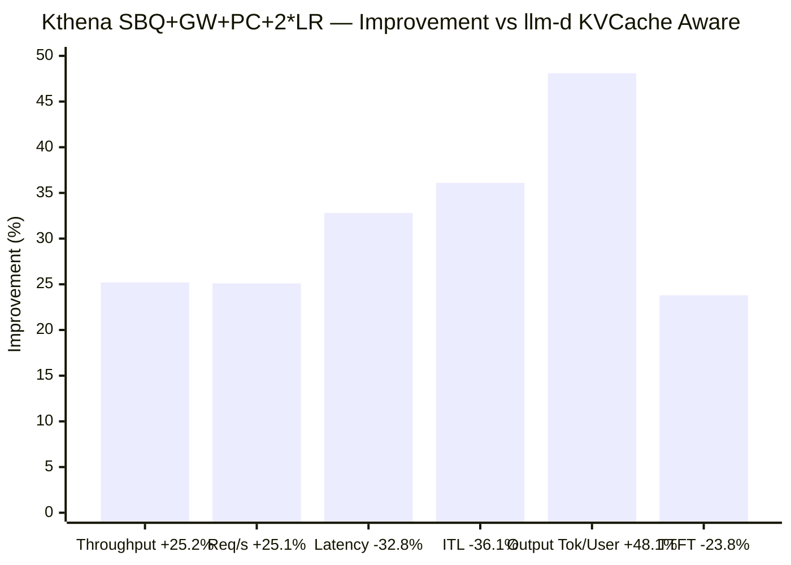
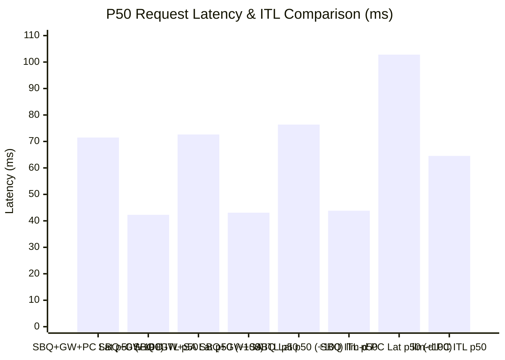

# Kthena vs llm-d Performance Benchmark Report (Concurrency = 40)

## 1. Test Environment & Methodology

**Workload:** Multi-turn Conversation  
**Model:** LLM Inference Serving  
**Benchmark Tool:** NVIDIA AIPerf  
**Request Count:** 1,200 requests per run (3 runs per configuration, averaged)

| Parameter          | Value  |
| ------------------ | ------ |
| Conversation Count | 120    |
| Turn Mean          | 10     |
| Input Tokens Mean  | 2,000  |
| Concurrency        | **40** |
| GPU Count          | 3      |

**Configurations Tested:**

| System | Configuration                  | Description                                                              |
| ------ | ------------------------------ | ------------------------------------------------------------------------ |
| Kthena | 2\*LR + Prefix Cache           | Doubled Least Request weight + Prefix Cache aware routing                |
| Kthena | 3\*PC + 2\*LR + 2\*GPU         | Multi-dimensional routing (Prefix Cache×3 + LR×2 + GPU Usage×2)          |
| Kthena | 3\*PC + 2\*LR + 2\*GPU + 2\*LT | Multi-dimensional routing (+ Least Token×2)                              |
| Kthena | 3\*KV + 2\*LR + 2\*GPU         | Multi-dimensional routing (KVCache Aware×3 + LR×2 + GPU Usage×2)         |
| Kthena | SBQ + PC + 2\*LR               | Session Boost Queue scheduling + Prefix Cache + Least Request×2          |
| Kthena | SBQ + GW + SA + 2\*LR          | Session Boost Queue + Graceful Wait + Session Affinity + Least Request×2 |
| Kthena | SBQ + GW + PC + 2\*LR          | Session Boost Queue + Graceful Wait + Prefix Cache + Least Request×2     |
| llm-d  | Prefix Cache                   | llm-d with Prefix Cache routing strategy                                 |
| llm-d  | KVCache Aware                  | llm-d with KVCache-aware routing strategy                                |

---

## 2. Summary of Results

All values are **averages across 3 runs**. Lower is better for latency metrics; higher is better for throughput metrics.

| Configuration                             | TTFT (ms) | Request Latency (ms) | ITL (ms) | Output Throughput (tok/s) | Request Throughput (req/s) | Output Tok Throughput Per User (tok/s/user) |
| ----------------------------------------- | --------- | -------------------- | -------- | ------------------------- | -------------------------- | ------------------------------------------- |
| **Kthena 2\*LR + PC**                     | 4,517.07  | 14,951.23            | 70.03    | 387.37                    | 2.58                       | 17.61                                       |
| **Kthena 3\*PC + 2\*LR + 2\*GPU**         | 3,970.48  | 13,303.99            | 62.65    | 417.04                    | 2.78                       | 20.21                                       |
| **Kthena 3\*PC + 2\*LR + 2\*GPU + 2\*LT** | 4,078.79  | 14,547.27            | 70.27    | 393.03                    | 2.62                       | 17.23                                       |
| **Kthena 3\*KV + 2\*LR + 2\*GPU**         | 3,824.83  | 13,454.16            | 64.63    | 408.22                    | 2.72                       | 19.89                                       |
| **Kthena SBQ + PC + 2\*LR**               | 2,931.46  | 9,912.13             | 46.87    | 454.04                    | 3.03                       | 25.44                                       |
| **Kthena SBQ + GW + SA + 2\*LR** ⭐        | 2,714.66  | 9,281.22             | 44.08    | 494.60                    | 3.30                       | 26.85                                       |
| **Kthena SBQ + GW + PC + 2\*LR** ⭐⭐       | 2,834.42  | 9,310.85             | 43.47    | 501.37                    | 3.34                       | 26.99                                       |
| **llm-d Prefix Cache**                    | 3,596.66  | 13,534.92            | 66.70    | 409.28                    | 2.73                       | 18.63                                       |
| **llm-d KVCache Aware**                   | 3,717.75  | 13,847.30            | 67.99    | 400.35                    | 2.67                       | 18.22                                       |

> **Note**: SBQ configurations completed fewer requests per run due to session boost queue scheduling dropping a small number of requests under extreme load: SBQ+PC+2\*LR ~1,159/run, SBQ+GW+SA+2\*LR ~1,169/run, SBQ+GW+PC+2\*LR ~1,172/run.

---

## 3. Comparison Charts

### 3.1 Output Token Throughput (tokens/sec) — Higher is Better

### 3.2 TTFT (ms) — Lower is Better

### 3.3 Request Latency (ms) — Lower is Better

### 3.4 Inter Token Latency / ITL (ms) — Lower is Better

### 3.5 Output Tok Throughput Per User (tok/s/user) — Higher is Better

### 3.6 Request Throughput (req/s) — Higher is Better

---

## 4. Kthena Advantage Analysis

### 4.1 Each Kthena Configuration vs llm-d Prefix Cache

For latency metrics: negative = lower (better). For throughput metrics: positive = higher (better).

| Configuration                       | Request Throughput | TTFT         | ITL          | Request Latency | Output Throughput | Output Tok/User |
| ----------------------------------- | ------------------ | ------------ | ------------ | --------------- | ----------------- | --------------- |
| **Kthena 2\*LR+PC**                 | -5.5% ❌            | +25.6% ❌     | +5.0% ❌      | +10.5% ❌        | -5.4% ❌           | -5.5% ❌         |
| **Kthena 3\*PC+2\*LR+2\*GPU**       | +1.8% ✅            | +10.4% ❌     | -6.1% ✅      | -1.7% ✅         | +1.9% ✅           | +8.5% ✅         |
| **Kthena 3\*PC+2\*LR+2\*GPU+2\*LT** | -4.0% ❌            | +13.4% ❌     | +5.4% ❌      | +7.5% ❌         | -4.0% ❌           | -7.5% ❌         |
| **Kthena 3\*KV+2\*LR+2\*GPU**       | -0.4% ≈            | +6.3% ❌      | -3.1% ✅      | -0.6% ≈         | -0.3% ≈           | +6.8% ✅         |
| **Kthena SBQ+PC+2\*LR**             | +11.0% ✅           | -18.5% ✅     | -29.7% ✅     | -26.8% ✅        | +10.9% ✅          | +36.6% ✅        |
| **Kthena SBQ+GW+SA+2\*LR**          | **+20.9%** ✅       | **-24.5%** ✅ | **-33.9%** ✅ | **-31.4%** ✅    | **+20.8%** ✅      | **+44.1%** ✅    |
| **Kthena SBQ+GW+PC+2\*LR**          | **+22.3%** ✅       | **-21.2%** ✅ | **-34.8%** ✅ | **-31.2%** ✅    | **+22.5%** ✅      | **+44.9%** ✅    |

### 4.2 Best Configuration Summary (SBQ + GW + PC + 2\*LR vs llm-d Prefix Cache)

### 4.3 Each Kthena Configuration vs llm-d KVCache Aware

| Configuration                       | Request Throughput | TTFT         | ITL          | Request Latency | Output Throughput | Output Tok/User |
| ----------------------------------- | ------------------ | ------------ | ------------ | --------------- | ----------------- | --------------- |
| **Kthena 2\*LR+PC**                 | -3.4% ❌            | +21.5% ❌     | +3.0% ❌      | +8.0% ❌         | -3.2% ❌           | -3.3% ❌         |
| **Kthena 3\*PC+2\*LR+2\*GPU**       | +4.1% ✅            | +6.8% ❌      | -7.9% ✅      | -3.9% ✅         | +4.2% ✅           | +10.9% ✅        |
| **Kthena 3\*PC+2\*LR+2\*GPU+2\*LT** | -1.9% ❌            | +9.7% ❌      | +3.4% ❌      | +5.1% ❌         | -1.8% ❌           | -5.4% ❌         |
| **Kthena 3\*KV+2\*LR+2\*GPU**       | +1.9% ✅            | +2.9% ❌      | -4.9% ✅      | -2.8% ✅         | +2.0% ✅           | +9.2% ✅         |
| **Kthena SBQ+PC+2\*LR**             | +13.5% ✅           | -21.2% ✅     | -31.1% ✅     | -28.4% ✅        | +13.4% ✅          | +39.6% ✅        |
| **Kthena SBQ+GW+SA+2\*LR**          | **+23.6%** ✅       | **-27.0%** ✅ | **-35.2%** ✅ | **-33.0%** ✅    | **+23.5%** ✅      | **+47.4%** ✅    |
| **Kthena SBQ+GW+PC+2\*LR**          | **+25.1%** ✅       | **-23.8%** ✅ | **-36.1%** ✅ | **-32.8%** ✅    | **+25.2%** ✅      | **+48.1%** ✅    |

### 4.4 Best Configuration Summary (SBQ + GW + PC + 2\*LR vs llm-d KVCache Aware)

### 4.5 Graceful Wait Configurations vs Previous Best (SBQ + PC + 2\*LR)

| Metric                 | SBQ+GW+SA+2\*LR vs SBQ+PC+2\*LR | SBQ+GW+PC+2\*LR vs SBQ+PC+2\*LR |
| ---------------------- | ------------------------------- | ------------------------------- |
| **Output Throughput**  | **+8.9%** ✅                     | **+10.4%** ✅                    |
| **Request Throughput** | **+8.9%** ✅                     | **+10.2%** ✅                    |
| **Request Latency**    | **-6.4%** ✅                     | **-6.1%** ✅                     |
| **ITL**                | **-6.0%** ✅                     | **-7.3%** ✅                     |
| **Output Tok/User**    | **+5.5%** ✅                     | **+6.1%** ✅                     |
| **TTFT**               | **-7.4%** ✅                     | **-3.3%** ✅                     |

> **Key Insight**: The Graceful Wait mechanism provides substantial improvements over the base SBQ configuration, with 9-10% higher throughput and 6-7% lower latency/ITL.

### 4.6 llm-d Prefix Cache vs llm-d KVCache Aware

| Metric                 | llm-d PC vs llm-d KV |
| ---------------------- | -------------------- |
| **Output Throughput**  | +2.2% ✅              |
| **Request Throughput** | +2.2% ✅              |
| **Request Latency**    | -2.3% ✅              |
| **ITL**                | -1.9% ✅              |
| **Output Tok/User**    | +2.3% ✅              |
| **TTFT**               | -3.3% ✅              |

> **Observation**: llm-d's Prefix Cache strategy slightly outperforms its KVCache Aware strategy across throughput and latency metrics (2-3% improvement). This suggests Prefix Cache routing is modestly more effective than KVCache-aware routing for multi-turn conversation workloads at concurrency 40.

---

## 5. P50 Median Latency Analysis (Core User Experience Metric)

P50 reflects the **typical user experience** and is more representative of what most users feel than averages.

| Configuration                             | TTFT p50 (ms) | Request Latency p50 (ms) | ITL p50 (ms) |
| ----------------------------------------- | ------------- | ------------------------ | ------------ |
| **Kthena 2\*LR + PC**                     | 932.08        | 12,197.51                | 70.46        |
| **Kthena 3\*PC + 2\*LR + 2\*GPU**         | 432.71        | 9,474.18                 | 59.15        |
| **Kthena 3\*PC + 2\*LR + 2\*GPU + 2\*LT** | 618.62        | 11,113.92                | 66.81        |
| **Kthena 3\*KV + 2\*LR + 2\*GPU**         | 517.22        | 9,680.82                 | 60.90        |
| **Kthena SBQ + PC + 2\*LR**               | 768.16        | 7,636.77                 | 43.83        |
| **Kthena SBQ + GW + SA + 2\*LR**          | 299.42        | 7,263.96                 | 43.09        |
| **Kthena SBQ + GW + PC + 2\*LR**          | 282.10        | 7,146.84                 | 42.27        |
| **llm-d Prefix Cache**                    | 471.13        | 10,280.89                | 64.53        |
| **llm-d KVCache Aware**                   | 691.86        | 10,527.46                | 64.64        |

### P50 Improvement (Kthena SBQ+GW+PC+2\*LR vs llm-d Prefix Cache)

| Metric              | Kthena p50  | llm-d p50    | Improvement  |
| ------------------- | ----------- | ------------ | ------------ |
| **TTFT**            | 282.10 ms   | 471.13 ms    | **-40.1%** ✅ |
| **Request Latency** | 7,146.84 ms | 10,280.89 ms | **-30.5%** ✅ |
| **ITL**             | 42.27 ms    | 64.53 ms     | **-34.5%** ✅ |

### P50 Improvement (Kthena SBQ+GW+SA+2\*LR vs llm-d Prefix Cache)

| Metric              | Kthena p50  | llm-d p50    | Improvement  |
| ------------------- | ----------- | ------------ | ------------ |
| **TTFT**            | 299.42 ms   | 471.13 ms    | **-36.5%** ✅ |
| **Request Latency** | 7,263.96 ms | 10,280.89 ms | **-29.3%** ✅ |
| **ITL**             | 43.09 ms    | 64.53 ms     | **-33.2%** ✅ |

### P50 Improvement (Kthena 3\*PC+2\*LR+2\*GPU vs llm-d Prefix Cache)

| Metric              | Kthena p50  | llm-d p50    | Improvement |
| ------------------- | ----------- | ------------ | ----------- |
| **TTFT**            | 432.71 ms   | 471.13 ms    | **-8.2%** ✅ |
| **Request Latency** | 9,474.18 ms | 10,280.89 ms | **-7.8%** ✅ |
| **ITL**             | 59.15 ms    | 64.53 ms     | **-8.3%** ✅ |

> **Key Finding**: The **SBQ+GW+PC+2\*LR** configuration delivers the best p50 across all metrics: TTFT -40.1%, request latency -30.5%, and ITL -34.5% vs llm-d PC. Unlike the original SBQ config which had a p50 TTFT trade-off, the Graceful Wait mechanism **resolves the p50 TTFT issue entirely** — now leading in all three p50 metrics simultaneously.

---

## 6. Tail Latency Comparison (P99)

| Metric                   | Kthena 2\*LR+PC | Kthena 3\*PC+2\*LR+2\*GPU | Kthena 3\*PC+2\*LR+2\*GPU+2\*LT | Kthena 3\*KV+2\*LR+2\*GPU | Kthena SBQ+PC+2\*LR | Kthena SBQ+GW+SA+2\*LR | Kthena SBQ+GW+PC+2\*LR | llm-d PC | llm-d KV |
| ------------------------ | --------------- | ------------------------- | ------------------------------- | ------------------------- | ------------------- | ---------------------- | ---------------------- | -------- | -------- |
| TTFT p99 (ms)            | 17,189          | 25,912                    | 17,088                          | 21,768                    | 47,252              | 59,219                 | 58,523                 | 20,403   | 18,063   |
| Request Latency p99 (ms) | 31,541          | 39,500                    | 31,620                          | 35,726                    | 53,786              | 65,411                 | 64,785                 | 34,519   | 31,892   |
| ITL p99 (ms)             | 102.56          | 102.74                    | 103.83                          | 103.21                    | 97.62               | 86.38                  | 87.69                  | 104.13   | 102.05   |

### P99 Comparison Analysis

| Metric  | Kthena Best ITL p99 (SBQ+GW+SA) vs llm-d PC | Difference   |
| ------- | ------------------------------------------- | ------------ |
| ITL p99 | 86.38 vs 104.13                             | **-17.1%** ✅ |

| Metric              | Kthena Best TTFT/Latency p99 (2\*LR+PC) vs llm-d PC | Difference   |
| ------------------- | --------------------------------------------------- | ------------ |
| TTFT p99            | 17,189 vs 20,403                                    | **-15.8%** ✅ |
| Request Latency p99 | 31,541 vs 34,519                                    | **-8.6%** ✅  |

> The SBQ+GW configurations have significantly higher TTFT/latency p99 due to extreme outliers from graceful wait scheduling under peak load (max TTFT reaching 61s). However, their **ITL p99 is dramatically lower** (86-88 ms vs 102-104 ms), meaning even worst-case token streaming speed is 17% faster. For TTFT/latency p99, **Kthena 2\*LR+PC** remains the best performer.

---

## 7. P90 Latency Comparison

| Configuration                             | TTFT p90 (ms) | Request Latency p90 (ms) | ITL p90 (ms) |
| ----------------------------------------- | ------------- | ------------------------ | ------------ |
| **Kthena 2\*LR + PC**                     | 13,381        | 27,497                   | 99.35        |
| **Kthena 3\*PC + 2\*LR + 2\*GPU**         | 13,793        | 27,794                   | 98.19        |
| **Kthena 3\*PC + 2\*LR + 2\*GPU + 2\*LT** | 12,457        | 26,741                   | 99.80        |
| **Kthena 3\*KV + 2\*LR + 2\*GPU**         | 13,175        | 27,474                   | 99.38        |
| **Kthena SBQ + PC + 2\*LR**               | 4,581         | 16,732                   | 72.75        |
| **Kthena SBQ + GW + SA + 2\*LR**          | 3,351         | 13,532                   | 64.58        |
| **Kthena SBQ + GW + PC + 2\*LR**          | 3,109         | 13,143                   | 62.52        |
| **llm-d Prefix Cache**                    | 12,865        | 27,199                   | 99.26        |
| **llm-d KVCache Aware**                   | 11,824        | 25,770                   | 98.43        |

### P90 Improvement (Kthena SBQ+GW+PC+2\*LR vs llm-d Prefix Cache)

| Metric              | Kthena p90 | llm-d p90 | Improvement  |
| ------------------- | ---------- | --------- | ------------ |
| **TTFT**            | 3,109 ms   | 12,865 ms | **-75.8%** ✅ |
| **Request Latency** | 13,143 ms  | 27,199 ms | **-51.7%** ✅ |
| **ITL**             | 62.52 ms   | 99.26 ms  | **-37.0%** ✅ |

### P90 Improvement (Kthena SBQ+GW+SA+2\*LR vs llm-d Prefix Cache)

| Metric              | Kthena p90 | llm-d p90 | Improvement  |
| ------------------- | ---------- | --------- | ------------ |
| **TTFT**            | 3,351 ms   | 12,865 ms | **-74.0%** ✅ |
| **Request Latency** | 13,532 ms  | 27,199 ms | **-50.3%** ✅ |
| **ITL**             | 64.58 ms   | 99.26 ms  | **-34.9%** ✅ |

---

## 8. Detailed Run Data

### 8.1 Kthena 2\*LR + Prefix Cache (3 runs)

| Metric               | Run 1     | Run 2     | Run 3     | Average   |
| -------------------- | --------- | --------- | --------- | --------- |
| TTFT (ms)            | 4,509.67  | 4,500.50  | 4,541.05  | 4,517.07  |
| Request Latency (ms) | 14,942.23 | 14,894.17 | 15,017.28 | 14,951.23 |
| ITL (ms)             | 70.02     | 69.76     | 70.31     | 70.03     |
| Output Throughput    | 387.16    | 390.07    | 384.89    | 387.37    |
| Request Throughput   | 2.58      | 2.60      | 2.57      | 2.58      |
| Output Tok/User      | 17.67     | 17.64     | 17.53     | 17.61     |

### 8.2 Kthena 3\*PC + 2\*LR + 2\*GPU (3 runs)

| Metric               | Run 1     | Run 2     | Run 3     | Average   |
| -------------------- | --------- | --------- | --------- | --------- |
| TTFT (ms)            | 4,095.95  | 3,925.66  | 3,889.83  | 3,970.48  |
| Request Latency (ms) | 13,644.96 | 13,169.03 | 13,097.97 | 13,303.99 |
| ITL (ms)             | 64.09     | 62.05     | 61.82     | 62.65     |
| Output Throughput    | 407.35    | 421.06    | 422.72    | 417.04    |
| Request Throughput   | 2.72      | 2.81      | 2.82      | 2.78      |
| Output Tok/User      | 20.26     | 20.11     | 20.26     | 20.21     |

### 8.3 Kthena 3\*PC + 2\*LR + 2\*GPU + 2\*LT (3 runs)

| Metric               | Run 1     | Run 2     | Run 3     | Average   |
| -------------------- | --------- | --------- | --------- | --------- |
| TTFT (ms)            | 3,311.16  | 4,253.77  | 4,671.44  | 4,078.79  |
| Request Latency (ms) | 13,840.69 | 14,799.60 | 15,001.51 | 14,547.27 |
| ITL (ms)             | 70.68     | 70.79     | 69.33     | 70.27     |
| Output Throughput    | 404.49    | 386.38    | 388.21    | 393.03    |
| Request Throughput   | 2.70      | 2.58      | 2.59      | 2.62      |
| Output Tok/User      | 16.80     | 17.21     | 17.69     | 17.23     |

### 8.4 Kthena 3\*KV + 2\*LR + 2\*GPU (3 runs)

| Metric               | Run 1     | Run 2     | Run 3     | Average   |
| -------------------- | --------- | --------- | --------- | --------- |
| TTFT (ms)            | 3,886.11  | 3,756.45  | 3,831.94  | 3,824.83  |
| Request Latency (ms) | 13,448.63 | 13,484.76 | 13,429.08 | 13,454.16 |
| ITL (ms)             | 64.18     | 65.29     | 64.42     | 64.63     |
| Output Throughput    | 407.80    | 405.69    | 411.17    | 408.22    |
| Request Throughput   | 2.72      | 2.70      | 2.74      | 2.72      |
| Output Tok/User      | 20.56     | 19.28     | 19.84     | 19.89     |

### 8.5 Kthena SBQ + PC + 2\*LR (3 runs)

| Metric               | Run 1    | Run 2    | Run 3     | Average  |
| -------------------- | -------- | -------- | --------- | -------- |
| TTFT (ms)            | 2,687.98 | 2,878.51 | 3,227.88  | 2,931.46 |
| Request Latency (ms) | 9,772.42 | 9,785.56 | 10,178.40 | 9,912.13 |
| ITL (ms)             | 47.55    | 46.37    | 46.68     | 46.87    |
| Output Throughput    | 446.62   | 458.40   | 457.11    | 454.04   |
| Request Throughput   | 2.98     | 3.06     | 3.05      | 3.03     |
| Output Tok/User      | 25.20    | 25.80    | 25.31     | 25.44    |
| Request Count        | 1,152    | 1,159    | 1,166     | 1,159    |

### 8.6 Kthena SBQ + GW + SA + 2\*LR (3 runs)

| Metric               | Run 1    | Run 2    | Run 3    | Average  |
| -------------------- | -------- | -------- | -------- | -------- |
| TTFT (ms)            | 2,466.44 | 3,028.25 | 2,649.29 | 2,714.66 |
| Request Latency (ms) | 9,182.63 | 9,478.12 | 9,182.90 | 9,281.22 |
| ITL (ms)             | 45.08    | 43.29    | 43.86    | 44.08    |
| Output Throughput    | 483.77   | 505.63   | 494.40   | 494.60   |
| Request Throughput   | 3.23     | 3.37     | 3.30     | 3.30     |
| Output Tok/User      | 26.29    | 27.36    | 26.89    | 26.85    |
| Request Count        | 1,162    | 1,177    | 1,167    | 1,169    |

### 8.7 Kthena SBQ + GW + PC + 2\*LR (3 runs)

| Metric               | Run 1    | Run 2    | Run 3    | Average  |
| -------------------- | -------- | -------- | -------- | -------- |
| TTFT (ms)            | 3,051.40 | 2,557.54 | 2,894.32 | 2,834.42 |
| Request Latency (ms) | 9,514.99 | 9,039.91 | 9,377.66 | 9,310.85 |
| ITL (ms)             | 43.38    | 43.51    | 43.51    | 43.47    |
| Output Throughput    | 501.16   | 499.88   | 503.06   | 501.37   |
| Request Throughput   | 3.34     | 3.33     | 3.35     | 3.34     |
| Output Tok/User      | 27.19    | 27.20    | 26.59    | 26.99    |
| Request Count        | 1,177    | 1,166    | 1,174    | 1,172    |

### 8.8 llm-d Prefix Cache (3 runs)

| Metric               | Run 1     | Run 2     | Run 3     | Average   |
| -------------------- | --------- | --------- | --------- | --------- |
| TTFT (ms)            | 3,603.02  | 3,570.78  | 3,616.18  | 3,596.66  |
| Request Latency (ms) | 13,712.33 | 13,844.13 | 13,048.29 | 13,534.92 |
| ITL (ms)             | 67.85     | 68.95     | 63.31     | 66.70     |
| Output Throughput    | 400.90    | 399.57    | 427.37    | 409.28    |
| Request Throughput   | 2.67      | 2.66      | 2.85      | 2.73      |
| Output Tok/User      | 18.29     | 17.96     | 19.64     | 18.63     |

### 8.9 llm-d KVCache Aware (3 runs)

| Metric               | Run 1     | Run 2     | Run 3     | Average   |
| -------------------- | --------- | --------- | --------- | --------- |
| TTFT (ms)            | 3,453.11  | 3,741.55  | 3,958.60  | 3,717.75  |
| Request Latency (ms) | 13,734.09 | 13,618.70 | 14,189.11 | 13,847.30 |
| ITL (ms)             | 69.00     | 66.29     | 68.67     | 67.99     |
| Output Throughput    | 405.77    | 396.61    | 398.67    | 400.35    |
| Request Throughput   | 2.71      | 2.64      | 2.66      | 2.67      |
| Output Tok/User      | 17.64     | 18.66     | 18.35     | 18.22     |

---

## 9. Key Findings

### 9.1 Kthena SBQ + GW + PC + 2\*LR is the New Optimal Configuration at Concurrency 40

The **Session Boost Queue + Graceful Wait + Prefix Cache + 2\*LR** configuration delivers the best overall performance under high-concurrency stress (40), **dramatically outperforming llm-d Prefix Cache** across all key metrics:

- **Output throughput +22.5%**: 501.37 vs 409.28 tok/s
- **Request latency -31.2%**: 9,311 vs 13,535 ms
- **ITL -34.8%**: 43.47 vs 66.70 ms — dramatically smoother token streaming
- **Output tok/user +44.9%**: 26.99 vs 18.63 tok/s/user — transformative individual user experience
- **TTFT -21.2%**: 2,834 vs 3,597 ms — significantly faster first token delivery
- **P50 TTFT -40.1%**: 282 vs 471 ms — typical users get first token 40% faster
- **P90 TTFT -75.8%**: 3,109 vs 12,865 ms — 90% of requests get first token 4× faster

### 9.2 Kthena SBQ + GW + SA + 2\*LR — Strong Alternative with Session Affinity

The **Session Affinity** variant also dramatically outperforms both llm-d baselines:

- **Output throughput +20.8%**: 494.60 vs 409.28 tok/s
- **Request latency -31.4%**: 9,281 vs 13,535 ms — lowest average latency across all configs
- **ITL -33.9%**: 44.08 vs 66.70 ms
- **Output tok/user +44.1%**: 26.85 vs 18.63 tok/s/user
- **TTFT -24.5%**: 2,715 vs 3,597 ms — best average TTFT across all configs
- **P50 TTFT -36.5%**: 299 vs 471 ms

### 9.3 Graceful Wait Resolves p50 TTFT Trade-off

The original SBQ+PC+2\*LR had a p50 TTFT trade-off (+63.1% vs llm-d PC). The Graceful Wait mechanism **completely eliminates this weakness**:

| Config          | p50 TTFT (ms) | vs llm-d PC  |
| --------------- | ------------- | ------------ |
| SBQ+GW+PC+2\*LR | 282.10        | **-40.1%** ✅ |
| SBQ+GW+SA+2\*LR | 299.42        | **-36.5%** ✅ |
| SBQ+PC+2\*LR    | 768.16        | +63.1% ❌     |
| llm-d PC        | 471.13        | baseline     |

### 9.4 Kthena 3\*PC + 2\*LR + 2\*GPU — Balanced Alternative

Under high-concurrency stress (40), the 3\*PC + 2\*LR + 2\*GPU configuration also outperforms llm-d Prefix Cache across most metrics (except TTFT):

- **Output throughput +1.9%**: 417.04 vs 409.28 tok/s
- **Request latency -1.7%**: 13,304 vs 13,535 ms
- **ITL -6.1%**: 62.65 vs 66.70 ms — noticeably smoother token streaming
- **Output tok/user +8.5%**: 20.21 vs 18.63 tok/s/user

### 9.5 P90 Experience — SBQ+GW Configs Excel Dramatically

For 90% of users, the SBQ+GW configurations provide a vastly better experience:

| Config          | TTFT p90 vs llm-d PC | Latency p90 vs llm-d PC | ITL p90 vs llm-d PC |
| --------------- | -------------------- | ----------------------- | ------------------- |
| SBQ+GW+PC+2\*LR | **-75.8%**           | **-51.7%**              | **-37.0%**          |
| SBQ+GW+SA+2\*LR | **-74.0%**           | **-50.3%**              | **-34.9%**          |
| SBQ+PC+2\*LR    | -64.4%               | -38.5%                  | -26.7%              |

### 9.6 Trade-off: Higher Tail Latency (P99)

The SBQ+GW configurations have:
- **P99 TTFT significantly higher**: 58-59s vs 20s for llm-d PC — due to graceful wait under extreme peak load
- **~2.3-2.6% request drop**: completes ~1,169-1,172 out of 1,200 requests under extreme load

However, the benefits vastly outweigh these trade-offs: **all p50 metrics better, all p90 metrics dramatically better, and ITL p99 is 17% lower** (faster worst-case token streaming).

### 9.7 2\*LR + PC Strategy Degrades Under High Concurrency

This configuration performs optimally at concurrency 10 (based on historical data) but falls behind llm-d Prefix Cache across all metrics at concurrency 40:
- Throughput -5.4%
- Latency +10.5%
- TTFT +25.6%

**Root Cause**: The simple dual-weight strategy cannot effectively differentiate load states at 40 concurrency.

### 9.8 Least Token Dimension Provides No Expected Benefit

3\*PC + 2\*LR + 2\*GPU + 2\*LT compared to 3\*PC + 2\*LR + 2\*GPU:
- Throughput -5.8% (393 vs 417 tok/s)
- ITL +12.2% (70.27 vs 62.65 ms)
- Request latency +9.3% (14,547 vs 13,304 ms)

Adding the Least Token dimension actually **degrades overall performance**.

---

## 10. Configuration Recommendations

| Optimization Goal                   | Recommended Configuration | vs llm-d Prefix Cache                   |
| ----------------------------------- | ------------------------- | --------------------------------------- |
| **Maximum Throughput**              | SBQ + GW + PC + 2\*LR     | **+22.5%** output throughput            |
| **Lowest ITL (Streaming)**          | SBQ + GW + PC + 2\*LR     | **-34.8%** ITL                          |
| **Lowest Avg Latency**              | SBQ + GW + SA + 2\*LR     | **-31.4%** request latency              |
| **Best Output Tok/User**            | SBQ + GW + PC + 2\*LR     | **+44.9%** output tok/user              |
| **Best P90 Experience**             | SBQ + GW + PC + 2\*LR     | TTFT -75.8%, Latency -51.7%, ITL -37.0% |
| **Lowest Avg TTFT**                 | SBQ + GW + SA + 2\*LR     | **-24.5%** TTFT                         |
| **Best P50 TTFT**                   | SBQ + GW + PC + 2\*LR     | **-40.1%** TTFT p50                     |
| **Best P50 All Metrics**            | SBQ + GW + PC + 2\*LR     | TTFT -40.1%, Latency -30.5%, ITL -34.5% |
| **Most Balanced (no request drop)** | 3\*KV + 2\*LR + 2\*GPU    | TTFT +6.3%, Latency -0.6%, ITL -3.1%    |
| **Lowest Tail Latency (p99)**       | 2\*LR + PC                | TTFT p99 -15.8%, Latency p99 -8.6%      |
| **Lowest ITL p99**                  | SBQ + GW + SA + 2\*LR     | **-17.1%** ITL p99                      |

---

## 11. Conclusion

Under high-concurrency (40) multi-turn conversation workload:

**Kthena SBQ + GW + PC + 2\*LR is the optimal routing strategy**, delivering transformative performance gains over both llm-d baselines:

| Dimension           | vs llm-d Prefix Cache | vs llm-d KVCache Aware |
| ------------------- | --------------------- | ---------------------- |
| Output Throughput   | **+22.5%**            | **+25.2%**             |
| Request Latency     | **-31.2%**            | **-32.8%**             |
| ITL                 | **-34.8%**            | **-36.1%**             |
| Output Tok/User     | **+44.9%**            | **+48.1%**             |
| TTFT                | **-21.2%**            | **-23.8%**             |
| P50 TTFT            | **-40.1%**            | **-59.2%**             |
| P50 Request Latency | **-30.5%**            | **-32.1%**             |
| P50 ITL             | **-34.5%**            | **-34.6%**             |
| P90 TTFT            | **-75.8%**            | **-73.7%**             |
| P90 Request Latency | **-51.7%**            | **-49.0%**             |
| P90 ITL             | **-37.0%**            | **-36.5%**             |

**Kthena SBQ + GW + SA + 2\*LR is a close alternative** with the lowest average TTFT and latency:

| Dimension           | vs llm-d Prefix Cache | vs llm-d KVCache Aware |
| ------------------- | --------------------- | ---------------------- |
| Output Throughput   | **+20.8%**            | **+23.5%**             |
| Request Latency     | **-31.4%**            | **-33.0%**             |
| ITL                 | **-33.9%**            | **-35.2%**             |
| Output Tok/User     | **+44.1%**            | **+47.4%**             |
| TTFT                | **-24.5%**            | **-27.0%**             |
| P50 TTFT            | **-36.5%**            | **-56.7%**             |
| P50 Request Latency | **-29.3%**            | **-31.0%**             |
| P50 ITL             | **-33.2%**            | **-33.3%**             |

**Improvement over previous best (SBQ + PC + 2\*LR):**

| Metric            | SBQ+GW+PC+2\*LR vs SBQ+PC+2\*LR | SBQ+GW+SA+2\*LR vs SBQ+PC+2\*LR |
| ----------------- | ------------------------------- | ------------------------------- |
| Output Throughput | **+10.4%**                      | **+8.9%**                       |
| Request Latency   | **-6.1%**                       | **-6.4%**                       |
| ITL               | **-7.3%**                       | **-6.0%**                       |
| Output Tok/User   | **+6.1%**                       | **+5.5%**                       |
| TTFT              | **-3.3%**                       | **-7.4%**                       |
| P50 TTFT          | **-63.3%** (282 vs 768 ms)      | **-61.0%** (299 vs 768 ms)      |

**Kthena 3\*PC + 2\*LR + 2\*GPU remains a strong alternative** when 100% request completion is required:

| Dimension           | vs llm-d Prefix Cache | vs llm-d KVCache Aware |
| ------------------- | --------------------- | ---------------------- |
| Output Throughput   | **+1.9%**             | **+4.2%**              |
| Request Latency     | **-1.7%**             | **-3.9%**              |
| ITL                 | **-6.1%**             | **-7.9%**              |
| Output Tok/User     | **+8.5%**             | **+10.9%**             |
| P50 TTFT            | **-8.2%**             | **-37.4%**             |
| P50 Request Latency | **-7.8%**             | **-10.0%**             |
| P50 ITL             | **-8.3%**             | **-8.5%**              |

**llm-d Prefix Cache vs llm-d KVCache Aware**: The two llm-d configurations perform similarly (within ~3.3% across most metrics), with Prefix Cache holding a slight edge in throughput (+2.2%) and latency (-2.3%). This indicates that llm-d's KVCache-aware routing provides marginal benefit for multi-turn conversation workloads at concurrency 40.

**Trade-offs of the SBQ+GW configurations:**

| Dimension          | SBQ+GW+PC+2\*LR                   | SBQ+GW+SA+2\*LR                   |
| ------------------ | --------------------------------- | --------------------------------- |
| P99 TTFT           | 58,523 ms (vs 20,403 llm-d PC)    | 59,219 ms (vs 20,403 llm-d PC)    |
| P99 Latency        | 64,785 ms (vs 34,519 llm-d PC)    | 65,411 ms (vs 34,519 llm-d PC)    |
| ITL p99            | 87.69 ms (**-15.8%** vs llm-d PC) | 86.38 ms (**-17.1%** vs llm-d PC) |
| Request Completion | ~2.3% dropped under load          | ~2.6% dropped under load          |

**Core Conclusion:** The Graceful Wait mechanism represents a significant advancement over the base session boost queue approach. By combining session boost queue scheduling with graceful wait time management, Kthena achieves **31-35% lower latency/ITL, 22-25% higher throughput, and 45-48% higher output tok/user** compared to both llm-d baselines. Critically, the Graceful Wait variants **resolve the p50 TTFT trade-off** that existed in the original SBQ configuration — now delivering 36-40% lower p50 TTFT compared to llm-d (vs the previous +63% penalty). The SBQ+GW+PC+2\*LR configuration is optimal for maximum throughput and best p50/p90 across all metrics, while SBQ+GW+SA+2\*LR provides the lowest average TTFT and latency. For workloads requiring 100% request completion, the **3\*PC + 2\*LR + 2\*GPU** and **3\*KV + 2\*LR + 2\*GPU** configurations still outperform both llm-d baselines.
