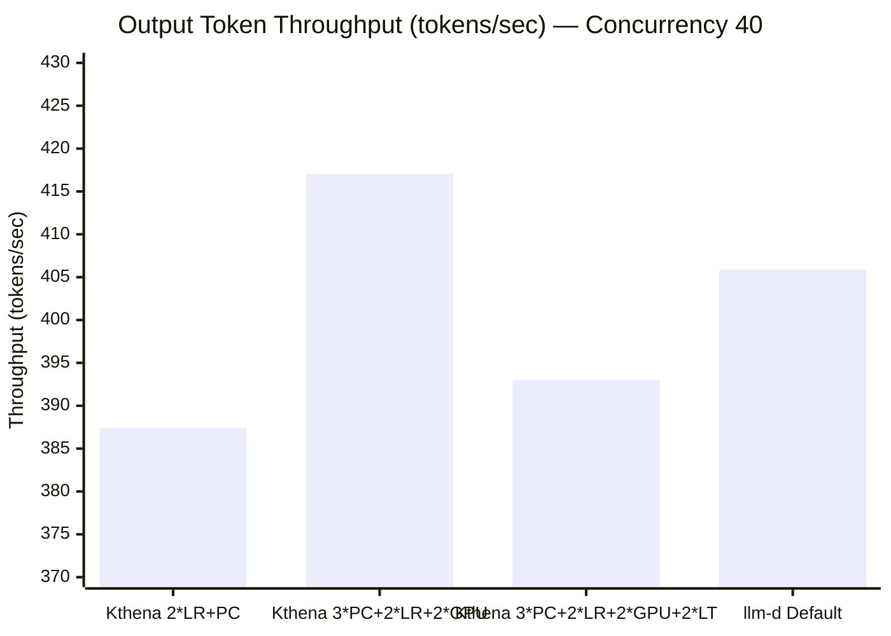
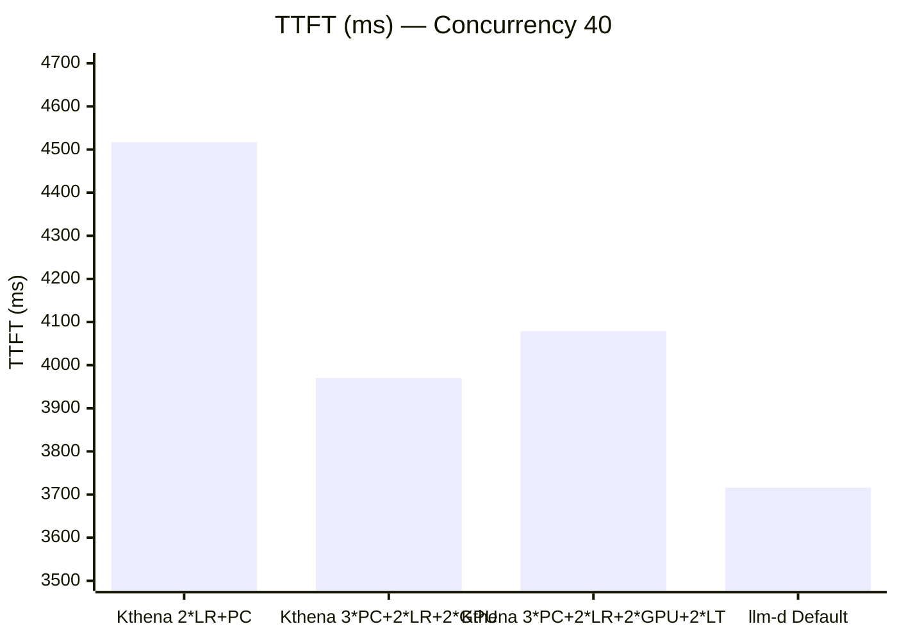
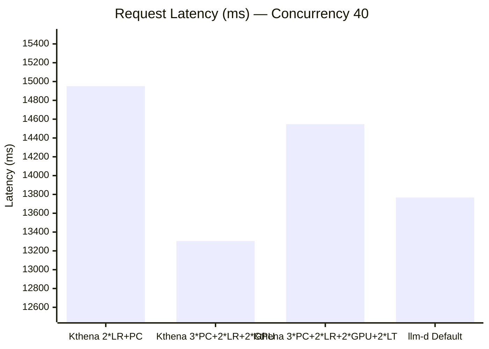
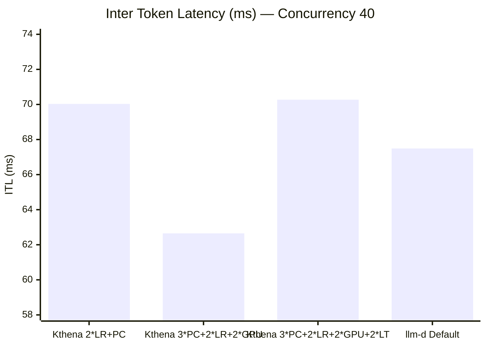
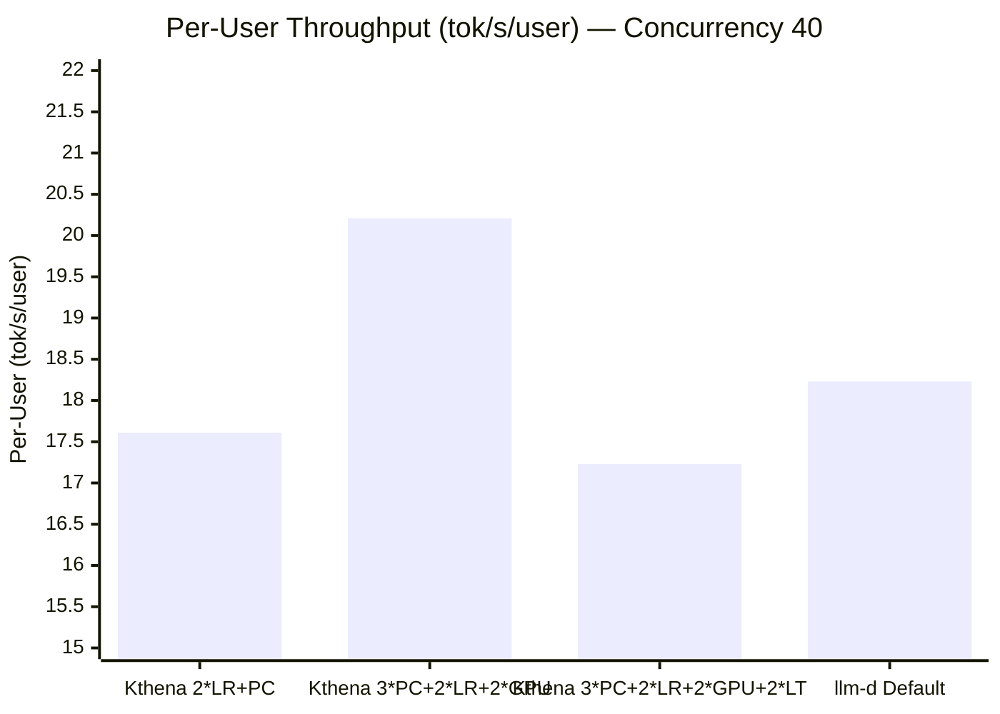
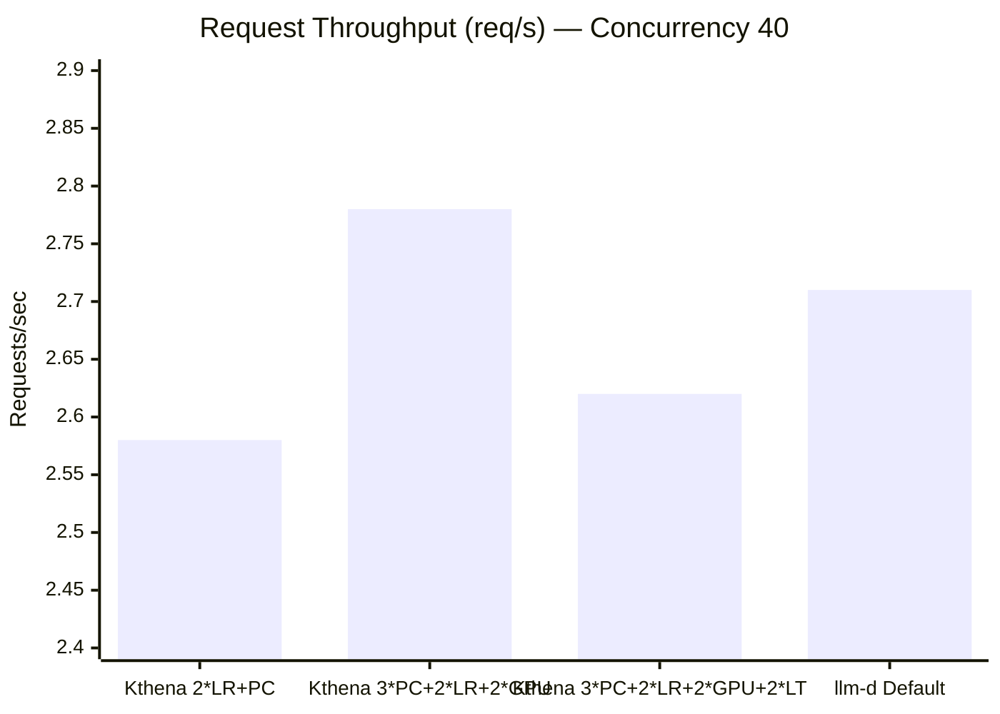
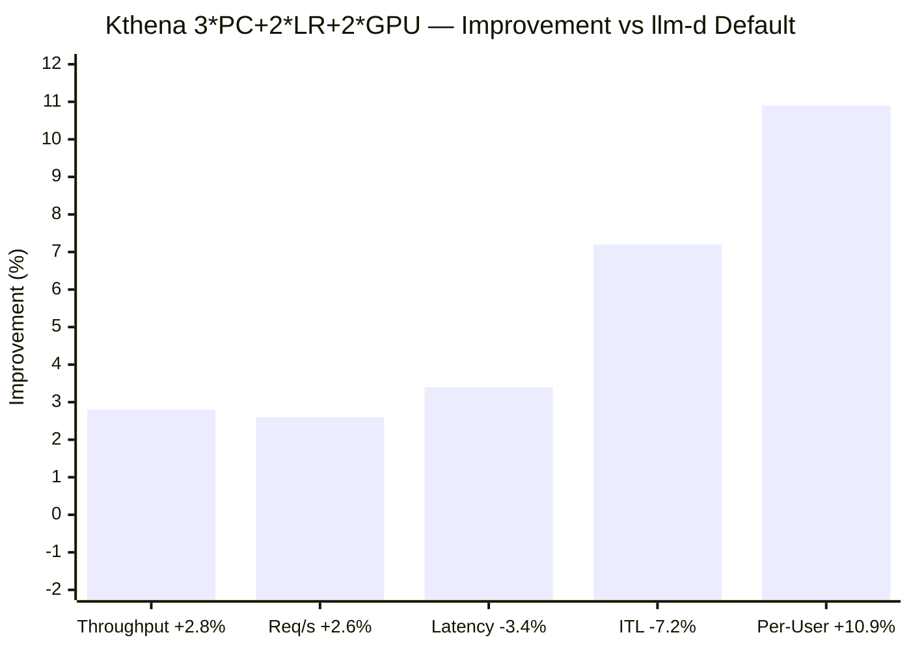

# Kthena vs llm-d Performance Benchmark Report (Concurrency = 40)

## 1. Test Environment & Methodology

**Workload:** Multi-turn Conversation  
**Model:** LLM Inference Serving  
**Benchmark Tool:** NVIDIA AIPerf  
**Request Count:** 1,200 requests per run (3 runs per configuration, averaged)

| Parameter          | Value  |
| ------------------ | ------ |
| Conversation Count | 120    |
| Turn Mean          | 10     |
| Input Tokens Mean  | 2,000  |
| Concurrency        | **40** |
| GPU Count          | 3      |

**Configurations Tested:**

| System | Configuration                  | Description                                                     |
| ------ | ------------------------------ | --------------------------------------------------------------- |
| Kthena | 2\*LR + Prefix Cache           | Doubled Least Request weight + Prefix Cache aware routing       |
| Kthena | 3\*PC + 2\*LR + 2\*GPU         | Multi-dimensional routing (Prefix Cache×3 + LR×2 + GPU Usage×2) |
| Kthena | 3\*PC + 2\*LR + 2\*GPU + 2\*LT | Multi-dimensional routing (+ Least Token×2)                     |
| llm-d  | Default                        | llm-d default routing strategy                                  |

---

## 2. Summary of Results

All values are **averages across 3 runs**. Lower is better for latency metrics; higher is better for throughput metrics.

| Configuration                             | TTFT (ms) | Request Latency (ms) | ITL (ms) | Output Throughput (tok/s) | Request Throughput (req/s) | Per-User Throughput (tok/s/user) | Latency Std Dev (ms) |
| ----------------------------------------- | --------- | -------------------- | -------- | ------------------------- | -------------------------- | -------------------------------- | -------------------- |
| **Kthena 2\*LR + PC**                     | 4,517.07  | 14,951.23            | 70.03    | 387.37                    | 2.58                       | 17.61                            | 8,476.79             |
| **Kthena 3\*PC + 2\*LR + 2\*GPU**         | 3,970.48  | 13,303.99            | 62.65    | 417.04                    | 2.78                       | 20.21                            | 9,211.07             |
| **Kthena 3\*PC + 2\*LR + 2\*GPU + 2\*LT** | 4,078.79  | 14,547.27            | 70.27    | 393.03                    | 2.62                       | 17.23                            | 8,072.47             |
| **llm-d Default**                         | 3,715.96  | 13,767.99            | 67.49    | 405.87                    | 2.71                       | 18.23                            | 7,963.06             |

---

## 3. Comparison Charts

### 3.1 Output Token Throughput (tokens/sec) — Higher is Better

### 3.2 TTFT (ms) — Lower is Better

### 3.3 Request Latency (ms) — Lower is Better

### 3.4 Inter Token Latency / ITL (ms) — Lower is Better

### 3.5 Per-User Throughput (tok/s/user) — Higher is Better

### 3.6 Request Throughput (req/s) — Higher is Better

---

## 4. Kthena Advantage Analysis

### 4.1 Each Kthena Configuration vs llm-d Default

For latency metrics: negative = lower (better). For throughput metrics: positive = higher (better).

| Metric                  | Kthena 2\*LR+PC | Kthena 3\*PC+2\*LR+2\*GPU | Kthena 3\*PC+2\*LR+2\*GPU+2\*LT |
| ----------------------- | --------------- | ------------------------- | ------------------------------- |
| **Output Throughput**   | -4.6% ❌         | **+2.8%** ✅               | -3.2% ❌                         |
| **Request Throughput**  | -4.8% ❌         | **+2.6%** ✅               | -3.3% ❌                         |
| **Request Latency**     | +8.6% ❌         | **-3.4%** ✅               | +5.7% ❌                         |
| **ITL**                 | +3.8% ❌         | **-7.2%** ✅               | +4.1% ❌                         |
| **Per-User Throughput** | -3.4% ❌         | **+10.9%** ✅              | -5.5% ❌                         |
| **TTFT**                | +21.6% ❌        | +6.9% ❌                   | +9.8% ❌                         |
| **Latency Std Dev**     | +6.5% ❌         | +15.7% ❌                  | +1.4% ≈                         |

### 4.2 Best Configuration Summary (3\*PC + 2\*LR + 2\*GPU)

---

## 5. P50 Median Latency Analysis (Core User Experience Metric)

P50 reflects the **typical user experience** and is more representative of what most users feel than averages.

| Configuration                             | TTFT p50 (ms) | Request Latency p50 (ms) | ITL p50 (ms) |
| ----------------------------------------- | ------------- | ------------------------ | ------------ |
| **Kthena 2\*LR + PC**                     | 932.08        | 12,197.51                | 70.46        |
| **Kthena 3\*PC + 2\*LR + 2\*GPU**         | 432.71        | 9,474.18                 | 59.15        |
| **Kthena 3\*PC + 2\*LR + 2\*GPU + 2\*LT** | 618.62        | 11,113.92                | 66.81        |
| **llm-d Default**                         | 545.87        | 10,593.20                | 65.38        |

### P50 Improvement (Kthena 3\*PC+2\*LR+2\*GPU vs llm-d Default)

| Metric              | Kthena p50  | llm-d p50    | Improvement  |
| ------------------- | ----------- | ------------ | ------------ |
| **TTFT**            | 432.71 ms   | 545.87 ms    | **-20.7%** ✅ |
| **Request Latency** | 9,474.18 ms | 10,593.20 ms | **-10.6%** ✅ |
| **ITL**             | 59.15 ms    | 65.38 ms     | **-9.5%** ✅  |

> **Key Finding**: Although llm-d has better average TTFT, **Kthena's p50 TTFT is 20.7% lower**. This means Kthena delivers faster first-token response for **the majority of requests**, but a small number of tail-latency requests raise the average.

```mermaid
xychart-beta
    title "P50 Latency Comparison (ms) — Kthena 3*PC+2*LR+2*GPU vs llm-d Default"
    x-axis ["TTFT p50", "Request Latency p50 (÷100)", "ITL p50"]
    y-axis "Latency (ms)" 0 --> 700
    bar [432.71, 94.74, 59.15]
    bar [545.87, 105.93, 65.38]
```

---

## 6. Tail Latency Comparison (P99)

| Metric                   | Kthena 2\*LR+PC | Kthena 3\*PC+2\*LR+2\*GPU | Kthena 3\*PC+2\*LR+2\*GPU+2\*LT | llm-d Default |
| ------------------------ | --------------- | ------------------------- | ------------------------------- | ------------- |
| TTFT p99 (ms)            | 17,189          | 25,912                    | 17,088                          | 18,018        |
| Request Latency p99 (ms) | 31,541          | 39,500                    | 31,620                          | 32,242        |
| ITL p99 (ms)             | 102.56          | 102.74                    | 103.83                          | 103.46        |

### P99 Comparison Analysis

| Metric              | Kthena Best (2\*LR+PC) vs llm-d Default | Difference  |
| ------------------- | --------------------------------------- | ----------- |
| TTFT p99            | 17,189 vs 18,018                        | **-4.6%** ✅ |
| Request Latency p99 | 31,541 vs 32,242                        | **-2.2%** ✅ |
| ITL p99             | 102.56 vs 103.46                        | **-0.9%** ≈ |

> For p99 tail latency, **Kthena 2\*LR+PC** performs best with lower TTFT p99 and request latency p99 than llm-d Default. The **3\*PC+2\*LR+2\*GPU** configuration, while excelling in throughput and median latency, has higher p99 tail latency.

---

## 7. P90 Latency Comparison

| Configuration                             | TTFT p90 (ms) | Request Latency p90 (ms) | ITL p90 (ms) |
| ----------------------------------------- | ------------- | ------------------------ | ------------ |
| **Kthena 2\*LR + PC**                     | 13,381        | 27,497                   | 99.35        |
| **Kthena 3\*PC + 2\*LR + 2\*GPU**         | 13,793        | 27,794                   | 98.19        |
| **Kthena 3\*PC + 2\*LR + 2\*GPU + 2\*LT** | 12,457        | 26,741                   | 99.80        |
| **llm-d Default**                         | 12,099        | 26,085                   | 98.71        |

---

## 8. Detailed Run Data

### 8.1 Kthena 2\*LR + Prefix Cache (3 runs)

| Metric               | Run 1     | Run 2     | Run 3     | Average   |
| -------------------- | --------- | --------- | --------- | --------- |
| TTFT (ms)            | 4,509.67  | 4,500.50  | 4,541.05  | 4,517.07  |
| Request Latency (ms) | 14,942.23 | 14,894.17 | 15,017.28 | 14,951.23 |
| ITL (ms)             | 70.02     | 69.76     | 70.31     | 70.03     |
| Output Throughput    | 387.16    | 390.07    | 384.89    | 387.37    |
| Request Throughput   | 2.58      | 2.60      | 2.57      | 2.58      |
| Per-User Throughput  | 17.67     | 17.64     | 17.53     | 17.61     |
| Latency Std Dev      | 8,434.73  | 8,435.67  | 8,559.98  | 8,476.79  |

### 8.2 Kthena 3\*PC + 2\*LR + 2\*GPU (3 runs)

| Metric               | Run 1     | Run 2     | Run 3     | Average   |
| -------------------- | --------- | --------- | --------- | --------- |
| TTFT (ms)            | 4,095.95  | 3,925.66  | 3,889.83  | 3,970.48  |
| Request Latency (ms) | 13,644.96 | 13,169.03 | 13,097.97 | 13,303.99 |
| ITL (ms)             | 64.09     | 62.05     | 61.82     | 62.65     |
| Output Throughput    | 407.35    | 421.06    | 422.72    | 417.04    |
| Request Throughput   | 2.72      | 2.81      | 2.82      | 2.78      |
| Per-User Throughput  | 20.26     | 20.11     | 20.26     | 20.21     |
| Latency Std Dev      | 9,154.03  | 9,225.80  | 9,253.39  | 9,211.07  |

### 8.3 Kthena 3\*PC + 2\*LR + 2\*GPU + 2\*LT (3 runs)

| Metric               | Run 1     | Run 2     | Run 3     | Average   |
| -------------------- | --------- | --------- | --------- | --------- |
| TTFT (ms)            | 3,311.16  | 4,253.77  | 4,671.44  | 4,078.79  |
| Request Latency (ms) | 13,840.69 | 14,799.60 | 15,001.51 | 14,547.27 |
| ITL (ms)             | 70.68     | 70.79     | 69.33     | 70.27     |
| Output Throughput    | 404.49    | 386.38    | 388.21    | 393.03    |
| Request Throughput   | 2.70      | 2.58      | 2.59      | 2.62      |
| Per-User Throughput  | 16.80     | 17.21     | 17.69     | 17.23     |
| Latency Std Dev      | 7,238.58  | 8,240.87  | 8,737.97  | 8,072.47  |

### 8.4 llm-d Default (3 runs)

| Metric               | Run 1     | Run 2     | Run 3     | Average   |
| -------------------- | --------- | --------- | --------- | --------- |
| TTFT (ms)            | 3,397.38  | 3,799.73  | 3,950.77  | 3,715.96  |
| Request Latency (ms) | 13,270.99 | 14,255.16 | 13,777.81 | 13,767.99 |
| ITL (ms)             | 66.27     | 70.17     | 66.02     | 67.49     |
| Output Throughput    | 419.90    | 396.51    | 401.21    | 405.87    |
| Request Throughput   | 2.80      | 2.64      | 2.68      | 2.71      |
| Per-User Throughput  | 18.42     | 17.40     | 18.88     | 18.23     |
| Latency Std Dev      | 7,755.71  | 7,786.12  | 8,347.36  | 7,963.06  |

---

## 9. Key Findings

### 9.1 Kthena 3\*PC + 2\*LR + 2\*GPU is the Optimal Configuration at Concurrency 40

Under high-concurrency stress (40), **only the 3\*PC + 2\*LR + 2\*GPU configuration outperforms llm-d Default** across most metrics (except TTFT):

- **Output throughput +2.8%**: 417.04 vs 405.87 tok/s
- **Request latency -3.4%**: 13,304 vs 13,768 ms
- **ITL -7.2%**: 62.65 vs 67.49 ms — noticeably smoother token streaming
- **Per-user throughput +10.9%**: 20.21 vs 18.23 tok/s/user — significantly better individual user experience

### 9.2 P50 Median Experience — Kthena Leads Substantially

For the majority of users (p50 represents the experience of 50% of users):

- **TTFT p50 is 20.7% lower**: 432.71 ms vs 545.87 ms — most users perceive noticeably faster first-token delivery
- **Request latency p50 is 10.6% lower**: 9,474 ms vs 10,593 ms
- **ITL p50 is 9.5% lower**: 59.15 ms vs 65.38 ms

This indicates that Kthena's 3\*PC+2\*LR+2\*GPU strategy processes **typical requests** far more efficiently than llm-d, but a small number of tail-latency requests (possibly due to Prefix Cache routing computation overhead) raise the average.

### 9.3 Average TTFT — llm-d Performs Better

llm-d Default's average TTFT (3,716 ms) is lower than all Kthena configurations (best: 3,970 ms). The gap originates from high-percentile requests:

- Kthena 3\*PC+2\*LR+2\*GPU TTFT p99 reaches 25,912 ms, while llm-d is 18,018 ms
- However, at p50 Kthena surpasses llm-d (432.71 ms vs 545.87 ms)

This suggests Kthena has a small number of requests with excessive wait times under high concurrency, likely related to the computational overhead of multi-dimensional routing decisions or Prefix Cache matching variance.

### 9.4 2\*LR + PC Strategy Degrades Under High Concurrency

This configuration performs optimally at concurrency 10 (based on historical data) but falls behind llm-d Default across all metrics at concurrency 40:
- Throughput -4.6%
- Latency +8.6%
- TTFT +21.6%

**Root Cause**: The simple dual-weight strategy cannot effectively differentiate load states at 40 concurrency. The binary scoring of Prefix Cache combined with low-discrimination LR scores is insufficient for high-concurrency scenarios.

### 9.5 Least Token Dimension Provides No Expected Benefit

3\*PC + 2\*LR + 2\*GPU + 2\*LT compared to 3\*PC + 2\*LR + 2\*GPU:
- Throughput -5.8% (393 vs 417 tok/s)
- ITL +12.2% (70.27 vs 62.65 ms)
- Request latency +9.3% (14,547 vs 13,304 ms)

Adding the Least Token dimension actually **degrades overall performance**, likely because the additional constraint causes routing decisions to deviate from the throughput-optimal solution.

---

## 10. Configuration Recommendations

| Optimization Goal                 | Recommended Configuration      | vs llm-d Default                  |
| --------------------------------- | ------------------------------ | --------------------------------- |
| **Maximum Throughput**            | 3\*PC + 2\*LR + 2\*GPU         | +2.8% output throughput           |
| **Lowest ITL (Streaming)**        | 3\*PC + 2\*LR + 2\*GPU         | -7.2% ITL                         |
| **Best User Experience (p50)**    | 3\*PC + 2\*LR + 2\*GPU         | TTFT -20.7%, Latency -10.6%       |
| **Best Per-User Throughput**      | 3\*PC + 2\*LR + 2\*GPU         | +10.9% per-user throughput        |
| **Most Stable Latency (Low Std)** | 3\*PC + 2\*LR + 2\*GPU + 2\*LT | std 8,072 (lowest)                |
| **Lowest Tail Latency (p99)**     | 2\*LR + PC                     | TTFT p99 -4.6%, Latency p99 -2.2% |

---

## 11. Conclusion

Under high-concurrency (40) multi-turn conversation workload:

**Kthena 3\*PC + 2\*LR + 2\*GPU is the optimal routing strategy**, outperforming llm-d Default in the following dimensions:

| Dimension           | Advantage  |
| ------------------- | ---------- |
| Output Throughput   | **+2.8%**  |
| Request Latency     | **-3.4%**  |
| ITL                 | **-7.2%**  |
| Per-User Throughput | **+10.9%** |
| P50 TTFT            | **-20.7%** |
| P50 Request Latency | **-10.6%** |
| P50 ITL             | **-9.5%**  |

**Areas where llm-d Default performs better:**

| Dimension       | Gap               |
| --------------- | ----------------- |
| Average TTFT    | llm-d 6.9% lower  |
| P99 TTFT        | llm-d 30.5% lower |
| Latency Std Dev | llm-d 13.5% lower |

**Core Conclusion:** Under high-concurrency conditions, Kthena's multi-dimensional routing strategy still outperforms llm-d in **throughput, average latency, and user-perceived streaming speed (ITL/per-user throughput)**, with particularly significant improvements for the **majority of users (p50)**. However, **tail latency stability** requires further optimization to address the issue of a small number of requests experiencing excessive latency under extreme load.
