# Kthena vs llm-d Performance Benchmark Report

This report evaluates **Kthena** routing strategies against **llm-d** baselines on a
multi-turn conversation workload, under two distinct load levels:

- **Low Load** — concurrency **10** (latency-sensitive, cache-friendly regime)
- **High Load** — concurrency **40** (saturation / stress regime)

The goal is to show how each routing strategy behaves both when the cluster has spare
capacity and when it is pushed into saturation, where queueing and admission control
dominate the user experience.

---

## 1. Test Environment & Methodology

### 1.1 Benchmark Tool — NVIDIA AIPerf

All measurements were produced with **NVIDIA AIPerf**, an open-source LLM serving
benchmark harness:

- Repository: <https://github.com/ai-dynamo/aiperf>

AIPerf drives an OpenAI-compatible `chat` endpoint, generates synthetic multi-turn
conversations, streams responses token-by-token, and reports the standard LLM serving
metrics (TTFT, ITL, request latency, throughput) together with their full latency
distributions (p50/p90/p99).

### 1.2 Driver Script & Command

The benchmark was launched with the `multi-turn-conversation.sh` wrapper script using the
**`basic`** subcommand:

- Script: <https://github.com/YaoZengzeng/scripts/blob/master/aiperf/multi-turn-conversation.sh>
- Subcommand: `basic` (fixed-length conversations — `turn-stddev = 0`, no turn delays)

The `basic` subcommand expands to the following AIPerf invocation:

```bash
aiperf profile \
  --model "$MODEL" \
  --endpoint-type chat \
  --url "$URL" \
  --ui-type dashboard \
  --random-seed 42 \
  --tokenizer "$TOKENIZER" \
  --streaming \
  --conversation-num "$CONVERSATION_NUM" \
  --conversation-turn-mean "$TURN_MEAN" \
  --conversation-turn-stddev 0 \
  --concurrency "$CONCURRENCY" \
  --synthetic-input-tokens-mean "$INPUT_TOKENS_MEAN" \
  --output-tokens-mean "$OUTPUT_TOKENS_MEAN"
```

Example used to launch the high-load run:

```bash
CONVERSATION_NUM=120 TURN_MEAN=10 INPUT_TOKENS_MEAN=2000 CONCURRENCY=40 \
  ./multi-turn-conversation.sh basic
```

### 1.3 Key Parameters Explained

| AIPerf Flag                     | Script Variable      | Meaning                                                                                |
| ------------------------------- | -------------------- | -------------------------------------------------------------------------------------- |
| `--conversation-num`            | `CONVERSATION_NUM`   | Number of independent conversation sessions (each has a stable session/correlation id) |
| `--conversation-turn-mean`      | `TURN_MEAN`          | Average number of turns (request/response exchanges) per conversation                  |
| `--conversation-turn-stddev`    | `TURN_STDDEV` (=0)   | Fixed to 0 by `basic` → every conversation has exactly `TURN_MEAN` turns               |
| `--concurrency`                 | `CONCURRENCY`        | Number of conversations issued in parallel — the **primary load knob**                 |
| `--synthetic-input-tokens-mean` | `INPUT_TOKENS_MEAN`  | Mean prompt size per turn (drives prefix-cache / KV-cache pressure)                    |
| `--output-tokens-mean`          | `OUTPUT_TOKENS_MEAN` | Mean generated tokens per turn (drives decode/ITL cost)                                |
| `--streaming`                   | `STREAMING=true`     | Stream tokens so TTFT and ITL can be measured per token                                |
| `--random-seed`                 | `RANDOM_SEED=42`     | Fixes the synthetic dataset for reproducibility across runs and systems                |

> **Why total requests = `CONVERSATION_NUM × TURN_MEAN`.** Each conversation issues
> `TURN_MEAN` sequential turns, and turns within the same conversation must be processed in
> order (turn *N+1* depends on the response of turn *N*). This is what makes the workload
> **multi-turn**: every follow-up turn re-sends the growing conversation prefix, so routing a
> follow-up turn back to the pod that already holds that prefix in cache yields a large TTFT win.

### 1.4 Multi-Turn Conversation Flow

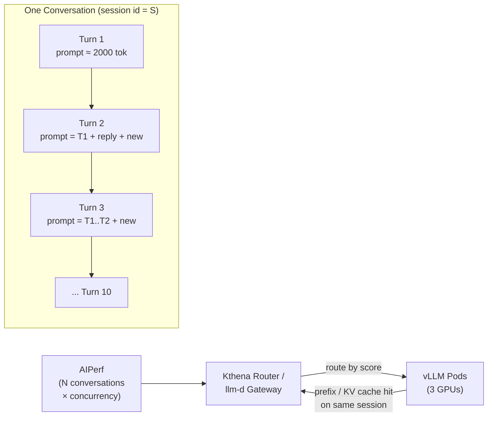
```mermaid
flowchart LR
    subgraph Conversation["One Conversation (session id = S)"]
        T1["Turn 1<br/>prompt ≈ 2000 tok"] --> T2["Turn 2<br/>prompt = T1 + reply + new"]
        T2 --> T3["Turn 3<br/>prompt = T1..T2 + new"]
        T3 --> Tn["... Turn 10"]
    end
    AIPerf["AIPerf<br/>(N conversations<br/>× concurrency)"] --> Router["Kthena Router /<br/>llm-d Gateway"]
    Router -->|route by score| Pods["vLLM Pods<br/>(3 GPUs)"]
    Pods -->|prefix / KV cache hit<br/>on same session| Router
```

Because each turn re-sends the prior context, the **prefix cache hit rate** is the dominant
performance lever: a router that keeps a session pinned to the pod holding its KV/prefix cache
avoids recomputing thousands of prompt tokens, slashing TTFT and freeing GPU cycles for decode.

### 1.5 Concurrency Model — Conversation Slots, Not Request Sampling

A critical detail of the AIPerf `basic` workload is **what "concurrency" actually means**. It is
the number of **conversation slots** that are active at the same time — *not* a random sample of
requests drawn from the whole pool.

- Concurrency `C` keeps **exactly `C` conversations in flight** at any instant.
- Within a slot, the conversation's turns run **strictly sequentially**: turn *N+1* is only sent
  **after** turn *N*'s full response is received (it depends on that response).
- A slot only picks up a **new** conversation **after its current conversation has finished all
  of its turns**. Conversations are processed to completion, one-after-another per slot.

So at concurrency **40**, there are always **40 distinct conversations** progressing in parallel.
The remaining conversations (e.g. the other 80 of the 120 total) **wait in a backlog** and are
admitted into a slot only as earlier conversations complete. It is **NOT** the case that all 120
conversations are live simultaneously with 40 random requests sampled from them.

```mermaid
flowchart LR
    subgraph Pool["Conversation Backlog (120 total)"]
        direction TB
        P["C5, C6, C7, ... C120<br/>(waiting, FIFO)"]
    end
    subgraph Slots["40 Concurrent Slots (always full)"]
        direction TB
        S1["Slot 1: Conv C1<br/>turn 1 → 2 → ... → 10"]
        S2["Slot 2: Conv C2<br/>turn 1 → 2 → ... → 10"]
        S3["Slot 3: Conv C3<br/>turn 1 → 2 → ... → 10"]
        Sd["..."]
        S40["Slot 40: Conv C4...<br/>turn 1 → 2 → ... → 10"]
    end
    Pool -->|"a slot frees only after<br/>ALL 10 turns finish"| Slots
    Slots -->|sequential turns<br/>(turn N+1 needs turn N reply)| Backend["Router → vLLM Pods"]
```

**Why this matters for the benchmark:**

- **Session locality is stable and exploitable.** Because a conversation stays in its slot until
  done, its 10 turns form one uninterrupted multi-turn sequence — exactly the pattern that
  prefix-cache / session-affinity routing is designed to accelerate. Each follow-up turn has a
  warm cache on the pod that served the previous turn.
- **Load is steady, not bursty.** The offered load is self-pacing: a turn is only issued once the
  previous turn returns, so total in-flight requests ≈ concurrency, and a new conversation enters
  only on completion. This is what lets concurrency act as a clean, repeatable load knob.
- **It rewards good admission control under saturation.** At C=40 with 3 GPUs, the 40 active
  conversations contend for limited capacity. A router that briefly holds a freed slot for the
  *same* session's next turn (Graceful Wait) or boosts recently-active sessions (SBQ) keeps each
  conversation's turns on a warm pod — directly improving end-to-end latency.

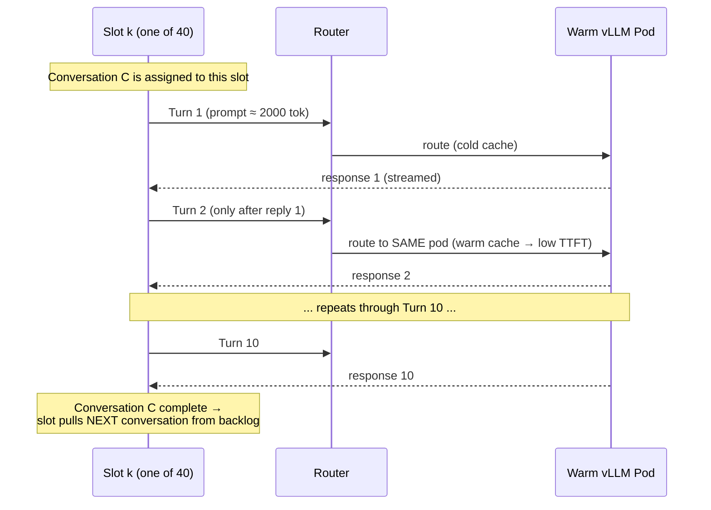
```mermaid
sequenceDiagram
    participant Slot as Slot k (one of 40)
    participant Router
    participant Pod as Warm vLLM Pod
    Note over Slot: Conversation C is assigned to this slot
    Slot->>Router: Turn 1 (prompt ≈ 2000 tok)
    Router->>Pod: route (cold cache)
    Pod-->>Slot: response 1 (streamed)
    Slot->>Router: Turn 2 (only after reply 1)
    Router->>Pod: route to SAME pod (warm cache → low TTFT)
    Pod-->>Slot: response 2
    Note over Slot,Pod: ... repeats through Turn 10 ...
    Slot->>Router: Turn 10
    Pod-->>Slot: response 10
    Note over Slot: Conversation C complete →<br/>slot pulls NEXT conversation from backlog
```

### 1.6 Load Scenarios — Low vs High

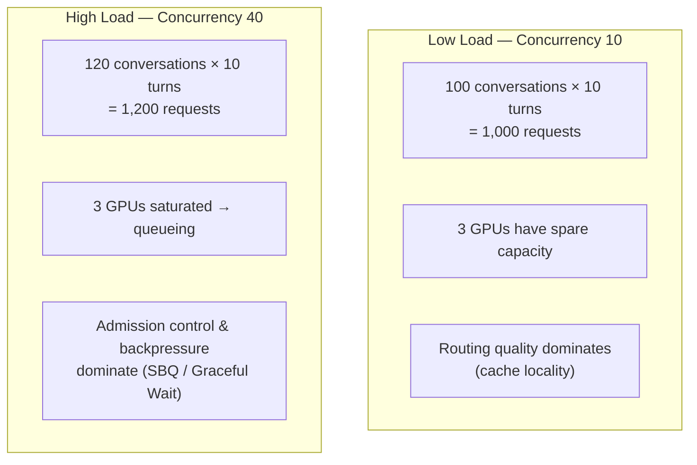
```mermaid
flowchart TB
    subgraph Low["Low Load — Concurrency 10"]
        L1["100 conversations × 10 turns<br/>= 1,000 requests"]
        L2["3 GPUs have spare capacity"]
        L3["Routing quality dominates<br/>(cache locality)"]
    end
    subgraph High["High Load — Concurrency 40"]
        H1["120 conversations × 10 turns<br/>= 1,200 requests"]
        H2["3 GPUs saturated → queueing"]
        H3["Admission control & backpressure<br/>dominate (SBQ / Graceful Wait)"]
    end
```

| Parameter            | Low Load         | High Load        |
| -------------------- | ---------------- | ---------------- |
| Concurrency          | **10**           | **40**           |
| Conversation Count   | 100              | 120              |
| Turn Mean            | 10               | 10               |
| Input Tokens Mean    | 2,000            | 2,000            |
| Output Tokens Mean   | (synthetic)      | (synthetic)      |
| Total Requests / run | ~1,000           | ~1,200           |
| Runs per config      | 3 (averaged)     | 3 (averaged)     |
| GPU Count            | 3                | 3                |
| Benchmark Tool       | AIPerf (`basic`) | AIPerf (`basic`) |

> **Reading the two regimes.** At **low load** the cluster is not bottlenecked, so the winner
> is whichever router maximizes prefix-cache locality (lower TTFT/ITL). At **high load** the
> GPUs saturate; raw cache locality is no longer enough, and the decisive factor becomes
> *queue management* — i.e. whether the router can hold and admit requests intelligently
> (Session Boost Queue + Graceful Wait) instead of dumping everything onto already-busy pods.

### 1.7 Configurations Tested

Different configuration families are emphasized at each load level: simple weighted routing
suffices at low load, whereas advanced queue-aware strategies are required at high load.

| System | Configuration                  | Tested At | Description                                              |
| ------ | ------------------------------ | --------- | -------------------------------------------------------- |
| Kthena | LR                             | Low       | Least Request load balancing, no cache optimization      |
| Kthena | LR + Prefix Cache              | Low       | Prefix-cache-aware routing, default weight               |
| Kthena | LR + Prefix Cache (W\*2)       | Low       | Prefix-cache-aware routing, doubled prefix weight        |
| Kthena | 2\*LR + Prefix Cache           | Low+High  | Doubled Least Request weight + Prefix Cache              |
| Kthena | LR + KVCache Aware             | Low       | KV-cache-aware routing (load + cache affinity)           |
| Kthena | 3\*PC + 2\*LR + 2\*GPU         | High      | Multi-dimensional (Prefix Cache×3 + LR×2 + GPU Usage×2)  |
| Kthena | 3\*PC + 2\*LR + 2\*GPU + 2\*LT | High      | Above + Least Token×2                                    |
| Kthena | 3\*KV + 2\*LR + 2\*GPU         | High      | Multi-dimensional (KVCache Aware×3 + LR×2 + GPU Usage×2) |
| Kthena | SBQ + PC + 2\*LR               | High      | **Session Boost Queue** + Prefix Cache + LR×2            |
| Kthena | SBQ + GW + SA + 2\*LR          | High      | SBQ + **Graceful Wait** + Session Affinity + LR×2        |
| Kthena | SBQ + GW + PC + 2\*LR          | High      | SBQ + Graceful Wait + Prefix Cache + LR×2                |
| llm-d  | Default                        | Low       | llm-d default routing                                    |
| llm-d  | Precise KV Cache               | Low       | llm-d KV-cache-aware routing                             |
| llm-d  | Prefix Cache                   | High      | llm-d prefix-cache routing                               |
| llm-d  | KVCache Aware                  | High      | llm-d KV-cache-aware routing                             |

**Glossary of Kthena mechanisms:**

- **LR (Least Request)** — prefer pods with fewest in-flight requests.
- **PC (Prefix Cache)** — prefer pods that already cache the request's prompt prefix.
- **KV (KVCache Aware)** — score pods by KV-cache residency of the conversation.
- **GPU** — factor in GPU utilization to avoid hot pods.
- **LT (Least Token)** — prefer pods with fewest queued tokens.
- **SBQ (Session Boost Queue)** — a router-side admission queue that boosts follow-up turns of
  recently-active sessions so they jump ahead and reuse a warm cache.
- **GW (Graceful Wait)** — briefly holds dispatch after a release so the *same* session's next
  turn can be admitted to its warm pod instead of an unrelated request grabbing the slot.
- **SA (Session Affinity)** — pin a session to its pod for cache stability.

---

# PART A — Low Load Results (Concurrency = 10)

At concurrency 10 the cluster has spare capacity, so the differentiator is **routing quality**
(cache locality), not queueing. All values are **averages across 3 runs** (~1,000 requests
each). Lower is better for latency; higher is better for throughput.

## A.1 Summary of Results

| Configuration                       | TTFT (ms) | Request Latency (ms) | ITL (ms) | Output Throughput (tok/s) | Request Throughput (req/s) | Per-User Throughput (tok/s/user) |
| ----------------------------------- | --------- | -------------------- | -------- | ------------------------- | -------------------------- | -------------------------------- |
| **Kthena LR**                       | 290.60    | 3,321.11             | 20.34    | 437.83                    | 2.92                       | 54.75                            |
| **Kthena LR + Prefix Cache**        | 236.82    | 3,104.78             | 19.26    | 468.26                    | 3.12                       | 58.85                            |
| **Kthena LR + Prefix Cache (W\*2)** | 248.49    | 3,096.63             | 19.12    | 457.77                    | 3.05                       | 59.36                            |
| **Kthena 2\*LR + Prefix Cache**     | 230.39    | 3,116.90             | 19.38    | 469.01                    | 3.13                       | 57.92                            |
| **Kthena LR + KVCache Aware**       | 304.39    | 3,133.19             | 18.99    | 465.10                    | 3.10                       | 60.26                            |
| **llm-d Default**                   | 270.03    | 3,705.12             | 23.05    | 390.26                    | 2.60                       | 58.81                            |
| **llm-d Precise KV Cache**          | 327.33    | 3,549.10             | 21.62    | 409.90                    | 2.73                       | 59.24                            |

## A.2 Comparison Charts

### A.2.1 Output Token Throughput (tokens/sec) — Higher is Better

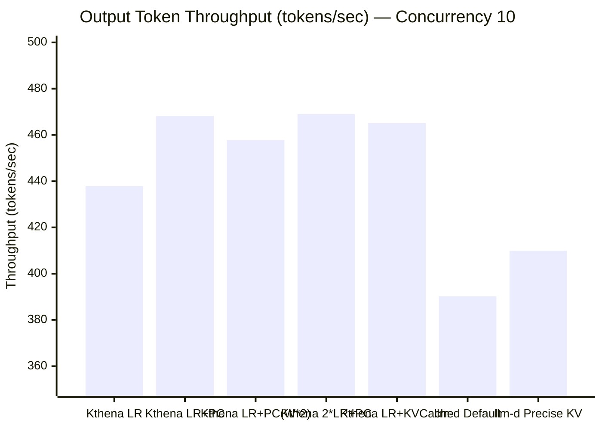
```mermaid
xychart-beta
    title "Output Token Throughput (tokens/sec) — Concurrency 10"
    x-axis ["Kthena LR", "Kthena LR+PC", "Kthena LR+PC(W*2)", "Kthena 2*LR+PC", "Kthena LR+KVCache", "llm-d Default", "llm-d Precise KV"]
    y-axis "Throughput (tokens/sec)" 350 --> 500
    bar [437.83, 468.26, 457.77, 469.01, 465.10, 390.26, 409.90]
```

### A.2.2 Time to First Token / TTFT (ms) — Lower is Better

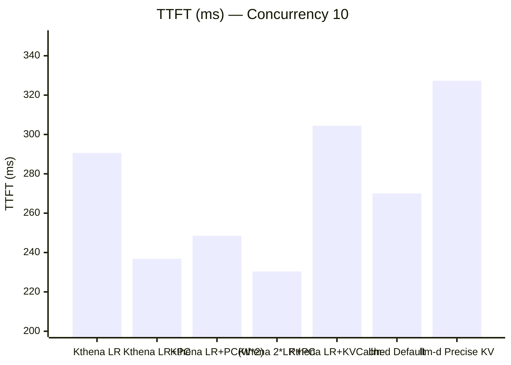
```mermaid
xychart-beta
    title "TTFT (ms) — Concurrency 10"
    x-axis ["Kthena LR", "Kthena LR+PC", "Kthena LR+PC(W*2)", "Kthena 2*LR+PC", "Kthena LR+KVCache", "llm-d Default", "llm-d Precise KV"]
    y-axis "TTFT (ms)" 200 --> 350
    bar [290.60, 236.82, 248.49, 230.39, 304.39, 270.03, 327.33]
```

### A.2.3 Request Latency (ms) — Lower is Better

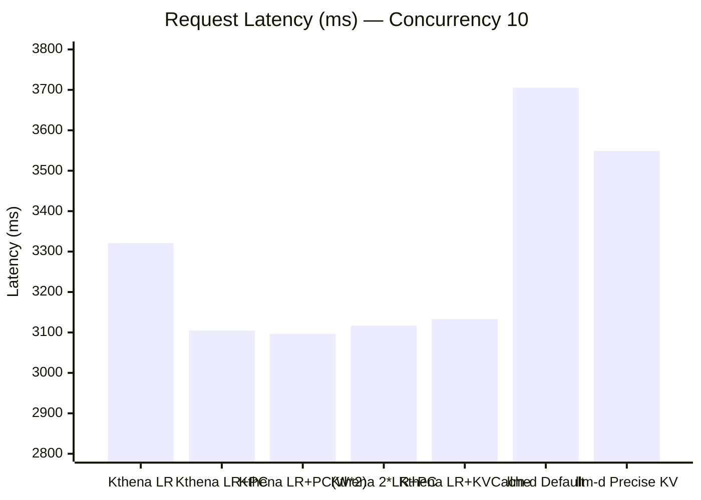
```mermaid
xychart-beta
    title "Request Latency (ms) — Concurrency 10"
    x-axis ["Kthena LR", "Kthena LR+PC", "Kthena LR+PC(W*2)", "Kthena 2*LR+PC", "Kthena LR+KVCache", "llm-d Default", "llm-d Precise KV"]
    y-axis "Latency (ms)" 2800 --> 3800
    bar [3321.11, 3104.78, 3096.63, 3116.90, 3133.19, 3705.12, 3549.10]
```

### A.2.4 Inter Token Latency / ITL (ms) — Lower is Better

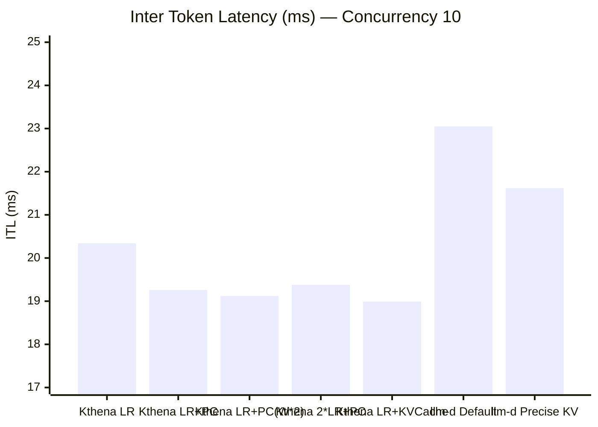
```mermaid
xychart-beta
    title "Inter Token Latency (ms) — Concurrency 10"
    x-axis ["Kthena LR", "Kthena LR+PC", "Kthena LR+PC(W*2)", "Kthena 2*LR+PC", "Kthena LR+KVCache", "llm-d Default", "llm-d Precise KV"]
    y-axis "ITL (ms)" 17 --> 25
    bar [20.34, 19.26, 19.12, 19.38, 18.99, 23.05, 21.62]
```

### A.2.5 Request Throughput (req/s) — Higher is Better

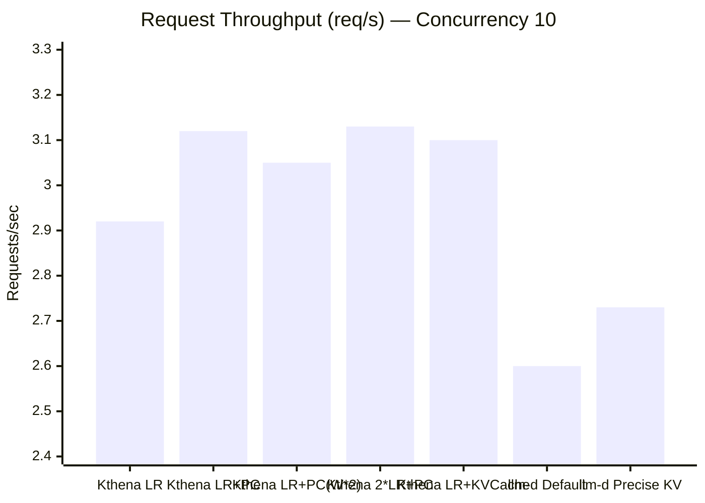
```mermaid
xychart-beta
    title "Request Throughput (req/s) — Concurrency 10"
    x-axis ["Kthena LR", "Kthena LR+PC", "Kthena LR+PC(W*2)", "Kthena 2*LR+PC", "Kthena LR+KVCache", "llm-d Default", "llm-d Precise KV"]
    y-axis "Requests/sec" 2.4 --> 3.3
    bar [2.92, 3.12, 3.05, 3.13, 3.10, 2.60, 2.73]
```

## A.3 Kthena Advantage Analysis

### A.3.1 Percentage Improvement — Kthena over llm-d

For latency metrics, improvement = reduction; for throughput metrics, improvement = increase.

#### vs. llm-d Default

| Metric                 | Kthena LR     | Kthena LR+PC | Kthena LR+PC(W\*2) | Kthena 2\*LR+PC | Kthena LR+KVCache |
| ---------------------- | ------------- | ------------ | ------------------ | --------------- | ----------------- |
| **Output Throughput**  | **+12.2%**    | **+20.0%**   | **+17.3%**         | **+20.2%**      | **+19.2%**        |
| **Request Throughput** | **+12.3%**    | **+20.0%**   | **+17.3%**         | **+20.4%**      | **+19.2%**        |
| **Request Latency**    | **-10.4%**    | **-16.2%**   | **-16.4%**         | **-15.9%**      | **-15.4%**        |
| **ITL**                | **-11.8%**    | **-16.4%**   | **-17.0%**         | **-15.9%**      | **-17.6%**        |
| **TTFT**               | +7.6% (worse) | **-12.3%**   | **-8.0%**          | **-14.7%**      | +12.7% (worse)    |

#### vs. llm-d Precise KV Cache

| Metric                 | Kthena LR  | Kthena LR+PC | Kthena LR+PC(W\*2) | Kthena 2\*LR+PC | Kthena LR+KVCache |
| ---------------------- | ---------- | ------------ | ------------------ | --------------- | ----------------- |
| **Output Throughput**  | **+6.8%**  | **+14.2%**   | **+11.7%**         | **+14.4%**      | **+13.5%**        |
| **Request Throughput** | **+7.0%**  | **+14.3%**   | **+11.7%**         | **+14.7%**      | **+13.6%**        |
| **Request Latency**    | **-6.4%**  | **-12.5%**   | **-12.7%**         | **-12.2%**      | **-11.7%**        |
| **ITL**                | **-5.9%**  | **-10.9%**   | **-11.6%**         | **-10.4%**      | **-12.2%**        |
| **TTFT**               | **-11.2%** | **-27.6%**   | **-24.1%**         | **-29.6%**      | **-7.0%**         |

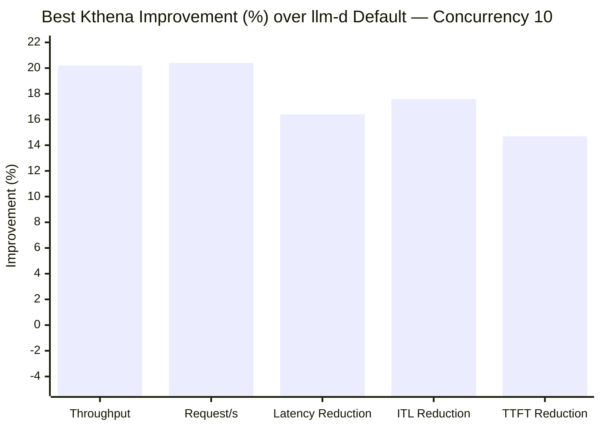
```mermaid
xychart-beta
    title "Best Kthena Improvement (%) over llm-d Default — Concurrency 10"
    x-axis ["Throughput", "Request/s", "Latency Reduction", "ITL Reduction", "TTFT Reduction"]
    y-axis "Improvement (%)" -5 --> 22
    bar [20.2, 20.4, 16.4, 17.6, 14.7]
```

### A.3.2 Latency Consistency — Lower Standard Deviation

| Configuration                   | Latency Std Dev (ms) |
| ------------------------------- | -------------------- |
| Kthena LR                       | 1,049.46             |
| Kthena LR + Prefix Cache        | 1,002.54             |
| Kthena LR + Prefix Cache (W\*2) | 988.30               |
| Kthena 2\*LR + Prefix Cache     | 983.71               |
| Kthena LR + KVCache Aware       | 1,076.22             |
| llm-d Default                   | 1,770.69             |
| llm-d Precise KV Cache          | 1,560.23             |

Kthena's latency variance is **~40-44% lower** than llm-d Default — a more consistent user
experience with fewer tail-latency outliers.

### A.3.3 Tail Latency (p99)

| Metric                   | Best Kthena (LR+PC) | llm-d Default | llm-d Precise KV | Kthena vs llm-d Default |
| ------------------------ | ------------------- | ------------- | ---------------- | ----------------------- |
| TTFT p99 (ms)            | ~625                | ~749          | ~902             | **-16.6%**              |
| Request Latency p99 (ms) | ~5,472              | ~7,637        | ~7,352           | **-28.4%**              |
| ITL p99 (ms)             | ~34.07              | ~47.88        | ~45.28           | **-28.8%**              |

## A.4 Low-Load Key Findings

- **Throughput:** Kthena delivers **12–20% higher** output throughput; best is 2\*LR + Prefix
  Cache at **469.01 tok/s** (vs llm-d's best 409.90).
- **Request latency:** **10–16% lower** average and **~28% lower** p99.
- **ITL:** **12–18% lower**, smoother streaming.
- **TTFT:** With prefix cache enabled, **15–30% lower** than llm-d. Without prefix cache, raw
  LR/KVCache TTFT is marginally higher than llm-d Default.
- **Best low-load config:** **Kthena 2\*LR + Prefix Cache** — simultaneously +20% throughput,
  -16% latency, -15% TTFT, -16% ITL vs llm-d Default.

---

# PART B — High Load Results (Concurrency = 40)

At concurrency 40 the 3 GPUs saturate, requests queue, and **admission control becomes the
dominant lever**. This is where Kthena's **Session Boost Queue (SBQ)** and **Graceful Wait
(GW)** mechanisms show their value. All values are **averages across 3 runs** (~1,200 requests
each).

## B.1 Summary of Results

| Configuration                             | TTFT (ms) | Request Latency (ms) | ITL (ms) | Output Throughput (tok/s) | Request Throughput (req/s) | Output Tok/User (tok/s/user) |
| ----------------------------------------- | --------- | -------------------- | -------- | ------------------------- | -------------------------- | ---------------------------- |
| **Kthena 2\*LR + PC**                     | 4,517.07  | 14,951.23            | 70.03    | 387.37                    | 2.58                       | 17.61                        |
| **Kthena 3\*PC + 2\*LR + 2\*GPU**         | 3,970.48  | 13,303.99            | 62.65    | 417.04                    | 2.78                       | 20.21                        |
| **Kthena 3\*PC + 2\*LR + 2\*GPU + 2\*LT** | 4,078.79  | 14,547.27            | 70.27    | 393.03                    | 2.62                       | 17.23                        |
| **Kthena 3\*KV + 2\*LR + 2\*GPU**         | 3,824.83  | 13,454.16            | 64.63    | 408.22                    | 2.72                       | 19.89                        |
| **Kthena SBQ + PC + 2\*LR**               | 2,931.46  | 9,912.13             | 46.87    | 454.04                    | 3.03                       | 25.44                        |
| **Kthena SBQ + GW + SA + 2\*LR** ⭐        | 2,714.66  | 9,281.22             | 44.08    | 494.60                    | 3.30                       | 26.85                        |
| **Kthena SBQ + GW + PC + 2\*LR** ⭐⭐       | 2,834.42  | 9,310.85             | 43.47    | 501.37                    | 3.34                       | 26.99                        |
| **llm-d Prefix Cache**                    | 3,596.66  | 13,534.92            | 66.70    | 409.28                    | 2.73                       | 18.63                        |
| **llm-d KVCache Aware**                   | 3,717.75  | 13,847.30            | 67.99    | 400.35                    | 2.67                       | 18.22                        |

> **Note:** SBQ configurations completed slightly fewer requests per run due to admission-queue
> scheduling dropping a small number of requests under extreme load: SBQ+PC+2\*LR ~1,159/run,
> SBQ+GW+SA+2\*LR ~1,169/run, SBQ+GW+PC+2\*LR ~1,172/run (out of 1,200).

## B.2 Comparison Charts

### B.2.1 Output Token Throughput (tokens/sec) — Higher is Better

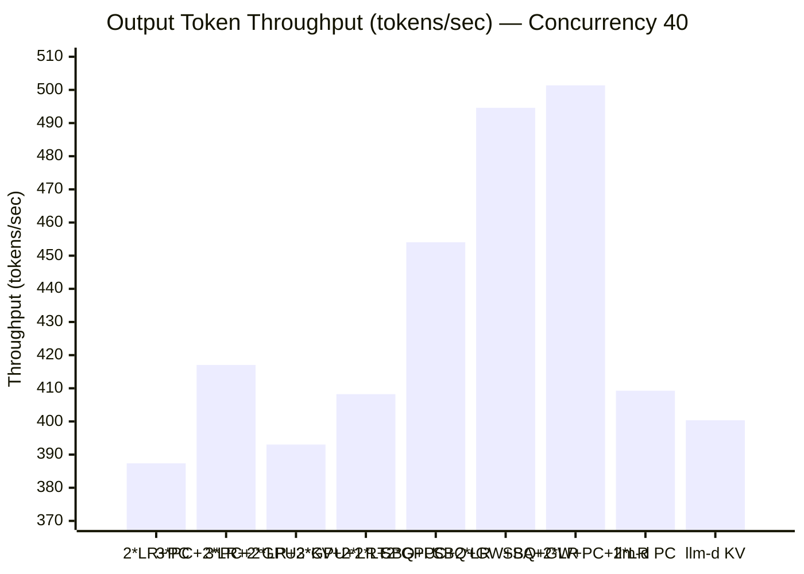
```mermaid
xychart-beta
    title "Output Token Throughput (tokens/sec) — Concurrency 40"
    x-axis ["2*LR+PC", "3*PC+2*LR+2*GPU", "3*PC+2*LR+2*GPU+2*LT", "3*KV+2*LR+2*GPU", "SBQ+PC+2*LR", "SBQ+GW+SA+2*LR", "SBQ+GW+PC+2*LR", "llm-d PC", "llm-d KV"]
    y-axis "Throughput (tokens/sec)" 370 --> 510
    bar [387.37, 417.04, 393.03, 408.22, 454.04, 494.60, 501.37, 409.28, 400.35]
```

### B.2.2 TTFT (ms) — Lower is Better

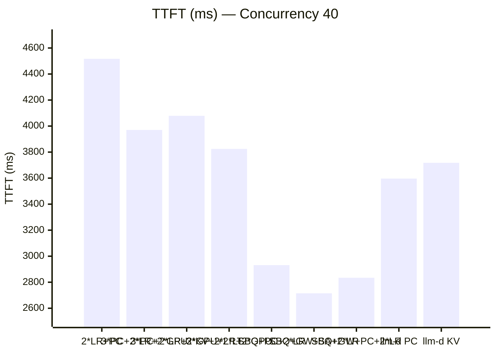
```mermaid
xychart-beta
    title "TTFT (ms) — Concurrency 40"
    x-axis ["2*LR+PC", "3*PC+2*LR+2*GPU", "3*PC+2*LR+2*GPU+2*LT", "3*KV+2*LR+2*GPU", "SBQ+PC+2*LR", "SBQ+GW+SA+2*LR", "SBQ+GW+PC+2*LR", "llm-d PC", "llm-d KV"]
    y-axis "TTFT (ms)" 2500 --> 4700
    bar [4517.07, 3970.48, 4078.79, 3824.83, 2931.46, 2714.66, 2834.42, 3596.66, 3717.75]
```

### B.2.3 Request Latency (ms) — Lower is Better

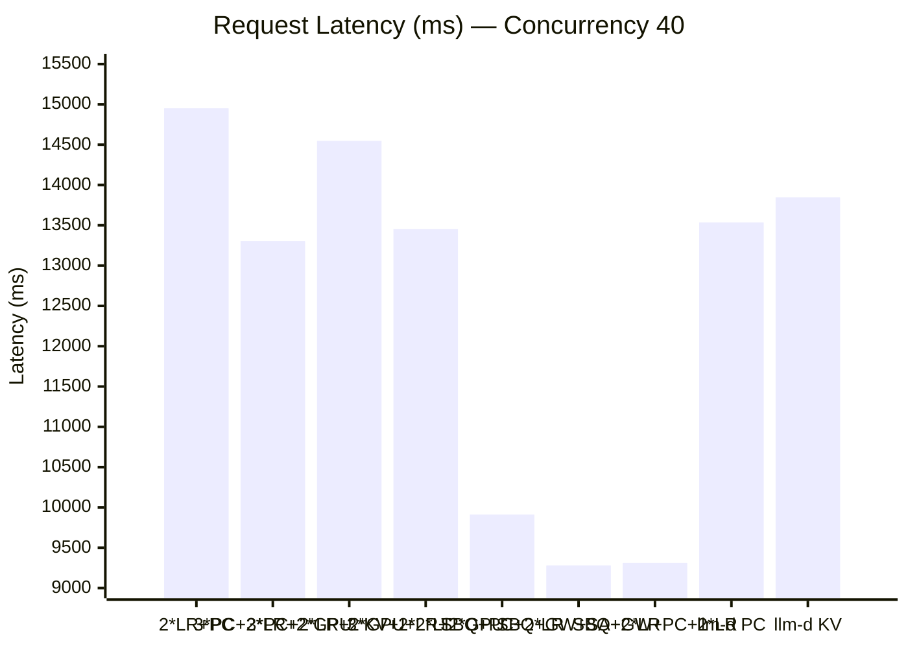
```mermaid
xychart-beta
    title "Request Latency (ms) — Concurrency 40"
    x-axis ["2*LR+PC", "3*PC+2*LR+2*GPU", "3*PC+2*LR+2*GPU+2*LT", "3*KV+2*LR+2*GPU", "SBQ+PC+2*LR", "SBQ+GW+SA+2*LR", "SBQ+GW+PC+2*LR", "llm-d PC", "llm-d KV"]
    y-axis "Latency (ms)" 9000 --> 15500
    bar [14951.23, 13303.99, 14547.27, 13454.16, 9912.13, 9281.22, 9310.85, 13534.92, 13847.30]
```

### B.2.4 Inter Token Latency / ITL (ms) — Lower is Better

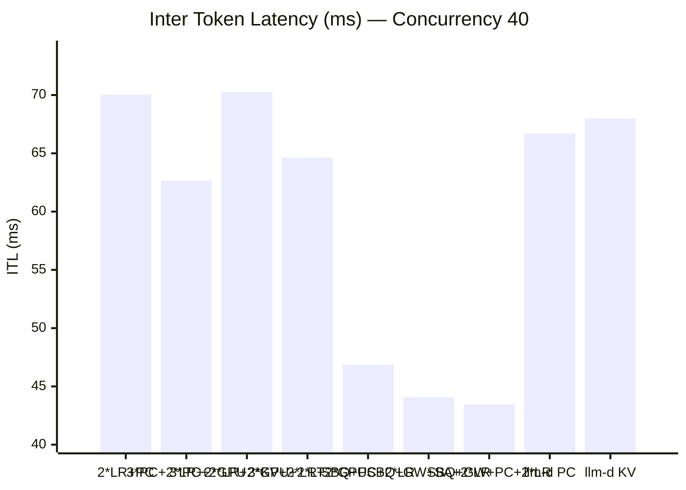
```mermaid
xychart-beta
    title "Inter Token Latency (ms) — Concurrency 40"
    x-axis ["2*LR+PC", "3*PC+2*LR+2*GPU", "3*PC+2*LR+2*GPU+2*LT", "3*KV+2*LR+2*GPU", "SBQ+PC+2*LR", "SBQ+GW+SA+2*LR", "SBQ+GW+PC+2*LR", "llm-d PC", "llm-d KV"]
    y-axis "ITL (ms)" 40 --> 74
    bar [70.03, 62.65, 70.27, 64.63, 46.87, 44.08, 43.47, 66.70, 67.99]
```

### B.2.5 Output Tok Throughput Per User (tok/s/user) — Higher is Better

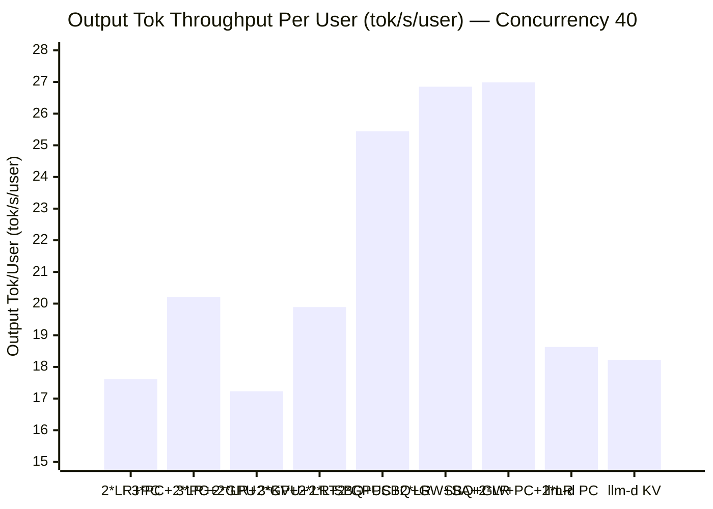
```mermaid
xychart-beta
    title "Output Tok Throughput Per User (tok/s/user) — Concurrency 40"
    x-axis ["2*LR+PC", "3*PC+2*LR+2*GPU", "3*PC+2*LR+2*GPU+2*LT", "3*KV+2*LR+2*GPU", "SBQ+PC+2*LR", "SBQ+GW+SA+2*LR", "SBQ+GW+PC+2*LR", "llm-d PC", "llm-d KV"]
    y-axis "Output Tok/User (tok/s/user)" 15 --> 28
    bar [17.61, 20.21, 17.23, 19.89, 25.44, 26.85, 26.99, 18.63, 18.22]
```

### B.2.6 Request Throughput (req/s) — Higher is Better

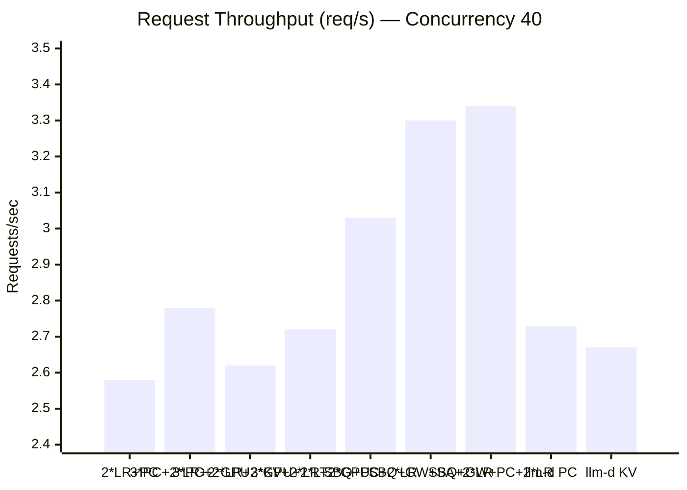
```mermaid
xychart-beta
    title "Request Throughput (req/s) — Concurrency 40"
    x-axis ["2*LR+PC", "3*PC+2*LR+2*GPU", "3*PC+2*LR+2*GPU+2*LT", "3*KV+2*LR+2*GPU", "SBQ+PC+2*LR", "SBQ+GW+SA+2*LR", "SBQ+GW+PC+2*LR", "llm-d PC", "llm-d KV"]
    y-axis "Requests/sec" 2.4 --> 3.5
    bar [2.58, 2.78, 2.62, 2.72, 3.03, 3.30, 3.34, 2.73, 2.67]
```

## B.3 Kthena Advantage Analysis

### B.3.1 Each Kthena Configuration vs llm-d Prefix Cache

For latency metrics: negative = lower (better). For throughput metrics: positive = higher (better).

| Configuration                       | Request Throughput | TTFT         | ITL          | Request Latency | Output Throughput | Output Tok/User |
| ----------------------------------- | ------------------ | ------------ | ------------ | --------------- | ----------------- | --------------- |
| **Kthena 2\*LR+PC**                 | -5.5% ❌            | +25.6% ❌     | +5.0% ❌      | +10.5% ❌        | -5.4% ❌           | -5.5% ❌         |
| **Kthena 3\*PC+2\*LR+2\*GPU**       | +1.8% ✅            | +10.4% ❌     | -6.1% ✅      | -1.7% ✅         | +1.9% ✅           | +8.5% ✅         |
| **Kthena 3\*PC+2\*LR+2\*GPU+2\*LT** | -4.0% ❌            | +13.4% ❌     | +5.4% ❌      | +7.5% ❌         | -4.0% ❌           | -7.5% ❌         |
| **Kthena 3\*KV+2\*LR+2\*GPU**       | -0.4% ≈            | +6.3% ❌      | -3.1% ✅      | -0.6% ≈         | -0.3% ≈           | +6.8% ✅         |
| **Kthena SBQ+PC+2\*LR**             | +11.0% ✅           | -18.5% ✅     | -29.7% ✅     | -26.8% ✅        | +10.9% ✅          | +36.6% ✅        |
| **Kthena SBQ+GW+SA+2\*LR**          | **+20.9%** ✅       | **-24.5%** ✅ | **-33.9%** ✅ | **-31.4%** ✅    | **+20.8%** ✅      | **+44.1%** ✅    |
| **Kthena SBQ+GW+PC+2\*LR**          | **+22.3%** ✅       | **-21.2%** ✅ | **-34.8%** ✅ | **-31.2%** ✅    | **+22.5%** ✅      | **+44.9%** ✅    |

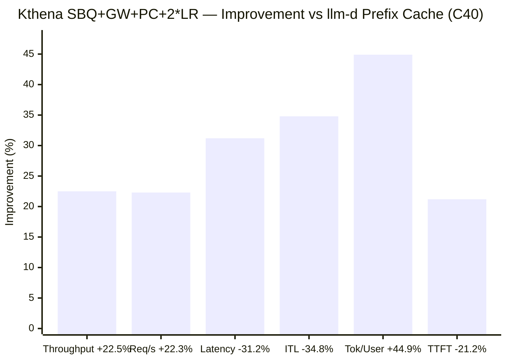
```mermaid
xychart-beta
    title "Kthena SBQ+GW+PC+2*LR — Improvement vs llm-d Prefix Cache (C40)"
    x-axis ["Throughput +22.5%", "Req/s +22.3%", "Latency -31.2%", "ITL -34.8%", "Tok/User +44.9%", "TTFT -21.2%"]
    y-axis "Improvement (%)" 0 --> 48
    bar [22.5, 22.3, 31.2, 34.8, 44.9, 21.2]
```

### B.3.2 Each Kthena Configuration vs llm-d KVCache Aware

| Configuration                       | Request Throughput | TTFT         | ITL          | Request Latency | Output Throughput | Output Tok/User |
| ----------------------------------- | ------------------ | ------------ | ------------ | --------------- | ----------------- | --------------- |
| **Kthena 2\*LR+PC**                 | -3.4% ❌            | +21.5% ❌     | +3.0% ❌      | +8.0% ❌         | -3.2% ❌           | -3.3% ❌         |
| **Kthena 3\*PC+2\*LR+2\*GPU**       | +4.1% ✅            | +6.8% ❌      | -7.9% ✅      | -3.9% ✅         | +4.2% ✅           | +10.9% ✅        |
| **Kthena 3\*PC+2\*LR+2\*GPU+2\*LT** | -1.9% ❌            | +9.7% ❌      | +3.4% ❌      | +5.1% ❌         | -1.8% ❌           | -5.4% ❌         |
| **Kthena 3\*KV+2\*LR+2\*GPU**       | +1.9% ✅            | +2.9% ❌      | -4.9% ✅      | -2.8% ✅         | +2.0% ✅           | +9.2% ✅         |
| **Kthena SBQ+PC+2\*LR**             | +13.5% ✅           | -21.2% ✅     | -31.1% ✅     | -28.4% ✅        | +13.4% ✅          | +39.6% ✅        |
| **Kthena SBQ+GW+SA+2\*LR**          | **+23.6%** ✅       | **-27.0%** ✅ | **-35.2%** ✅ | **-33.0%** ✅    | **+23.5%** ✅      | **+47.4%** ✅    |
| **Kthena SBQ+GW+PC+2\*LR**          | **+25.1%** ✅       | **-23.8%** ✅ | **-36.1%** ✅ | **-32.8%** ✅    | **+25.2%** ✅      | **+48.1%** ✅    |

### B.3.3 Graceful Wait vs Base SBQ (vs SBQ + PC + 2\*LR)

| Metric                 | SBQ+GW+SA+2\*LR | SBQ+GW+PC+2\*LR |
| ---------------------- | --------------- | --------------- |
| **Output Throughput**  | **+8.9%** ✅     | **+10.4%** ✅    |
| **Request Throughput** | **+8.9%** ✅     | **+10.2%** ✅    |
| **Request Latency**    | **-6.4%** ✅     | **-6.1%** ✅     |
| **ITL**                | **-6.0%** ✅     | **-7.3%** ✅     |
| **Output Tok/User**    | **+5.5%** ✅     | **+6.1%** ✅     |
| **TTFT**               | **-7.4%** ✅     | **-3.3%** ✅     |

> **Key Insight:** The Graceful Wait mechanism adds **9–10% throughput** and **6–7% lower
> latency/ITL** on top of the base SBQ configuration.

## B.4 P50 Median Latency (Typical User Experience)

| Configuration                       | TTFT p50 (ms) | Request Latency p50 (ms) | ITL p50 (ms) |
| ----------------------------------- | ------------- | ------------------------ | ------------ |
| **Kthena 2\*LR + PC**               | 932.08        | 12,197.51                | 70.46        |
| **Kthena 3\*PC + 2\*LR + 2\*GPU**   | 432.71        | 9,474.18                 | 59.15        |
| **Kthena 3\*PC+2\*LR+2\*GPU+2\*LT** | 618.62        | 11,113.92                | 66.81        |
| **Kthena 3\*KV + 2\*LR + 2\*GPU**   | 517.22        | 9,680.82                 | 60.90        |
| **Kthena SBQ + PC + 2\*LR**         | 768.16        | 7,636.77                 | 43.83        |
| **Kthena SBQ + GW + SA + 2\*LR**    | 299.42        | 7,263.96                 | 43.09        |
| **Kthena SBQ + GW + PC + 2\*LR**    | 282.10        | 7,146.84                 | 42.27        |
| **llm-d Prefix Cache**              | 471.13        | 10,280.89                | 64.53        |
| **llm-d KVCache Aware**             | 691.86        | 10,527.46                | 64.64        |

**SBQ+GW+PC+2\*LR vs llm-d Prefix Cache (p50):** TTFT **-40.1%** (282 vs 471 ms),
Request Latency **-30.5%** (7,147 vs 10,281 ms), ITL **-34.5%** (42.27 vs 64.53 ms).

> **Graceful Wait resolves the p50 TTFT trade-off.** Base SBQ+PC had a p50 TTFT penalty
> (768 ms, +63% vs llm-d). Adding Graceful Wait drops p50 TTFT to 282 ms (**-40%** vs llm-d) —
> now leading in all three p50 metrics simultaneously.

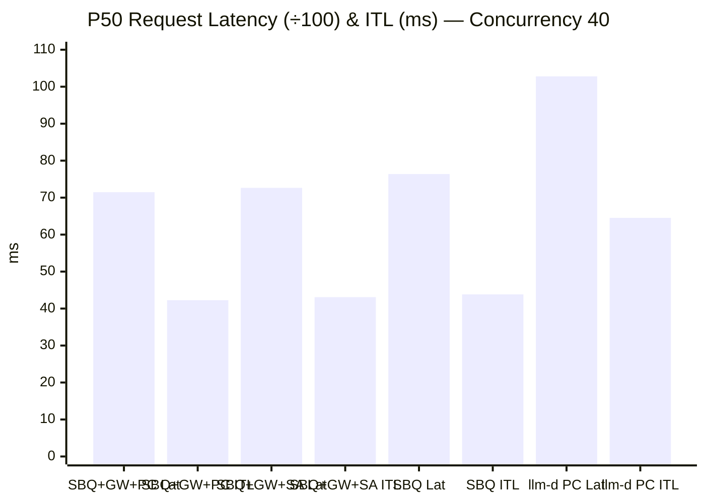
```mermaid
xychart-beta
    title "P50 Request Latency (÷100) & ITL (ms) — Concurrency 40"
    x-axis ["SBQ+GW+PC Lat", "SBQ+GW+PC ITL", "SBQ+GW+SA Lat", "SBQ+GW+SA ITL", "SBQ Lat", "SBQ ITL", "llm-d PC Lat", "llm-d PC ITL"]
    y-axis "ms" 0 --> 110
    bar [71.47, 42.27, 72.64, 43.09, 76.37, 43.83, 102.81, 64.53]
```

## B.5 P90 Latency

| Configuration                       | TTFT p90 (ms) | Request Latency p90 (ms) | ITL p90 (ms) |
| ----------------------------------- | ------------- | ------------------------ | ------------ |
| **Kthena 2\*LR + PC**               | 13,381        | 27,497                   | 99.35        |
| **Kthena 3\*PC + 2\*LR + 2\*GPU**   | 13,793        | 27,794                   | 98.19        |
| **Kthena 3\*PC+2\*LR+2\*GPU+2\*LT** | 12,457        | 26,741                   | 99.80        |
| **Kthena 3\*KV + 2\*LR + 2\*GPU**   | 13,175        | 27,474                   | 99.38        |
| **Kthena SBQ + PC + 2\*LR**         | 4,581         | 16,732                   | 72.75        |
| **Kthena SBQ + GW + SA + 2\*LR**    | 3,351         | 13,532                   | 64.58        |
| **Kthena SBQ + GW + PC + 2\*LR**    | 3,109         | 13,143                   | 62.52        |
| **llm-d Prefix Cache**              | 12,865        | 27,199                   | 99.26        |
| **llm-d KVCache Aware**             | 11,824        | 25,770                   | 98.43        |

**SBQ+GW+PC+2\*LR vs llm-d Prefix Cache (p90):** TTFT **-75.8%** (3,109 vs 12,865 ms),
Request Latency **-51.7%** (13,143 vs 27,199 ms), ITL **-37.0%** (62.52 vs 99.26 ms).

## B.6 Tail Latency (P99) — The Trade-off

| Metric                   | 2\*LR+PC | 3\*PC+2\*LR+2\*GPU | 3\*KV+2\*LR+2\*GPU | SBQ+PC+2\*LR | SBQ+GW+SA+2\*LR | SBQ+GW+PC+2\*LR | llm-d PC | llm-d KV |
| ------------------------ | -------- | ------------------ | ------------------ | ------------ | --------------- | --------------- | -------- | -------- |
| TTFT p99 (ms)            | 17,189   | 25,912             | 21,768             | 47,252       | 59,219          | 58,523          | 20,403   | 18,063   |
| Request Latency p99 (ms) | 31,541   | 39,500             | 35,726             | 53,786       | 65,411          | 64,785          | 34,519   | 31,892   |
| ITL p99 (ms)             | 102.56   | 102.74             | 103.21             | 97.62        | 86.38           | 87.69           | 104.13   | 102.05   |

> **The SBQ+GW trade-off:** to deliver dramatically better p50/p90 and average results, the
> SBQ+GW configs accept **higher TTFT/latency p99 outliers** (up to ~59s max TTFT under peak
> load) and a **~2.3–2.6% request drop**. However their **ITL p99 is the lowest** (86–88 ms vs
> 102–104 ms, **-17%**), so even worst-case token streaming is faster. For the lowest TTFT/latency
> p99, **2\*LR + PC** remains best (TTFT p99 -15.8%, Latency p99 -8.6% vs llm-d PC).

## B.7 High-Load Key Findings

- **SBQ + GW + PC + 2\*LR is the new optimum at C40**, beating llm-d Prefix Cache by
  **+22.5% throughput, -31.2% latency, -34.8% ITL, +44.9% tok/user, -21.2% TTFT**, and on p50
  by **-40.1% TTFT / -30.5% latency / -34.5% ITL**.
- **SBQ + GW + SA + 2\*LR** is a close alternative with the **lowest average TTFT (2,715 ms)**
  and **lowest average latency (9,281 ms)** of any config.
- **Graceful Wait** adds 9–10% throughput and resolves the base-SBQ p50 TTFT penalty.
- **For 100% request completion** (no drops), **3\*PC + 2\*LR + 2\*GPU** and
  **3\*KV + 2\*LR + 2\*GPU** still beat both llm-d baselines on most metrics.
- **Least Token (LT) dimension hurts:** 3\*PC+2\*LR+2\*GPU+2\*LT is ~6% worse than without LT.
- **2\*LR + PC degrades under saturation** (the low-load champion) — simple dual-weight routing
  cannot differentiate load states at C40 (throughput -5.4%, TTFT +25.6% vs llm-d PC).

## B.8 Detailed Run Data (Concurrency 40)

<details>
<summary>Per-run breakdown (3 runs each)</summary>

### Kthena 2\*LR + PC

| Metric               | Run 1     | Run 2     | Run 3     | Average   |
| -------------------- | --------- | --------- | --------- | --------- |
| TTFT (ms)            | 4,509.67  | 4,500.50  | 4,541.05  | 4,517.07  |
| Request Latency (ms) | 14,942.23 | 14,894.17 | 15,017.28 | 14,951.23 |
| ITL (ms)             | 70.02     | 69.76     | 70.31     | 70.03     |
| Output Throughput    | 387.16    | 390.07    | 384.89    | 387.37    |
| Request Throughput   | 2.58      | 2.60      | 2.57      | 2.58      |
| Output Tok/User      | 17.67     | 17.64     | 17.53     | 17.61     |

### Kthena 3\*PC + 2\*LR + 2\*GPU

| Metric               | Run 1     | Run 2     | Run 3     | Average   |
| -------------------- | --------- | --------- | --------- | --------- |
| TTFT (ms)            | 4,095.95  | 3,925.66  | 3,889.83  | 3,970.48  |
| Request Latency (ms) | 13,644.96 | 13,169.03 | 13,097.97 | 13,303.99 |
| ITL (ms)             | 64.09     | 62.05     | 61.82     | 62.65     |
| Output Throughput    | 407.35    | 421.06    | 422.72    | 417.04    |
| Request Throughput   | 2.72      | 2.81      | 2.82      | 2.78      |
| Output Tok/User      | 20.26     | 20.11     | 20.26     | 20.21     |

### Kthena 3\*PC + 2\*LR + 2\*GPU + 2\*LT

| Metric               | Run 1     | Run 2     | Run 3     | Average   |
| -------------------- | --------- | --------- | --------- | --------- |
| TTFT (ms)            | 3,311.16  | 4,253.77  | 4,671.44  | 4,078.79  |
| Request Latency (ms) | 13,840.69 | 14,799.60 | 15,001.51 | 14,547.27 |
| ITL (ms)             | 70.68     | 70.79     | 69.33     | 70.27     |
| Output Throughput    | 404.49    | 386.38    | 388.21    | 393.03    |
| Request Throughput   | 2.70      | 2.58      | 2.59      | 2.62      |
| Output Tok/User      | 16.80     | 17.21     | 17.69     | 17.23     |

### Kthena 3\*KV + 2\*LR + 2\*GPU

| Metric               | Run 1     | Run 2     | Run 3     | Average   |
| -------------------- | --------- | --------- | --------- | --------- |
| TTFT (ms)            | 3,886.11  | 3,756.45  | 3,831.94  | 3,824.83  |
| Request Latency (ms) | 13,448.63 | 13,484.76 | 13,429.08 | 13,454.16 |
| ITL (ms)             | 64.18     | 65.29     | 64.42     | 64.63     |
| Output Throughput    | 407.80    | 405.69    | 411.17    | 408.22    |
| Request Throughput   | 2.72      | 2.70      | 2.74      | 2.72      |
| Output Tok/User      | 20.56     | 19.28     | 19.84     | 19.89     |

### Kthena SBQ + PC + 2\*LR

| Metric               | Run 1    | Run 2    | Run 3     | Average  |
| -------------------- | -------- | -------- | --------- | -------- |
| TTFT (ms)            | 2,687.98 | 2,878.51 | 3,227.88  | 2,931.46 |
| Request Latency (ms) | 9,772.42 | 9,785.56 | 10,178.40 | 9,912.13 |
| ITL (ms)             | 47.55    | 46.37    | 46.68     | 46.87    |
| Output Throughput    | 446.62   | 458.40   | 457.11    | 454.04   |
| Request Throughput   | 2.98     | 3.06     | 3.05      | 3.03     |
| Output Tok/User      | 25.20    | 25.80    | 25.31     | 25.44    |
| Request Count        | 1,152    | 1,159    | 1,166     | 1,159    |

### Kthena SBQ + GW + SA + 2\*LR

| Metric               | Run 1    | Run 2    | Run 3    | Average  |
| -------------------- | -------- | -------- | -------- | -------- |
| TTFT (ms)            | 2,466.44 | 3,028.25 | 2,649.29 | 2,714.66 |
| Request Latency (ms) | 9,182.63 | 9,478.12 | 9,182.90 | 9,281.22 |
| ITL (ms)             | 45.08    | 43.29    | 43.86    | 44.08    |
| Output Throughput    | 483.77   | 505.63   | 494.40   | 494.60   |
| Request Throughput   | 3.23     | 3.37     | 3.30     | 3.30     |
| Output Tok/User      | 26.29    | 27.36    | 26.89    | 26.85    |
| Request Count        | 1,162    | 1,177    | 1,167    | 1,169    |

### Kthena SBQ + GW + PC + 2\*LR

| Metric               | Run 1    | Run 2    | Run 3    | Average  |
| -------------------- | -------- | -------- | -------- | -------- |
| TTFT (ms)            | 3,051.40 | 2,557.54 | 2,894.32 | 2,834.42 |
| Request Latency (ms) | 9,514.99 | 9,039.91 | 9,377.66 | 9,310.85 |
| ITL (ms)             | 43.38    | 43.51    | 43.51    | 43.47    |
| Output Throughput    | 501.16   | 499.88   | 503.06   | 501.37   |
| Request Throughput   | 3.34     | 3.33     | 3.35     | 3.34     |
| Output Tok/User      | 27.19    | 27.20    | 26.59    | 26.99    |
| Request Count        | 1,177    | 1,166    | 1,174    | 1,172    |

### llm-d Prefix Cache

| Metric               | Run 1     | Run 2     | Run 3     | Average   |
| -------------------- | --------- | --------- | --------- | --------- |
| TTFT (ms)            | 3,603.02  | 3,570.78  | 3,616.18  | 3,596.66  |
| Request Latency (ms) | 13,712.33 | 13,844.13 | 13,048.29 | 13,534.92 |
| ITL (ms)             | 67.85     | 68.95     | 63.31     | 66.70     |
| Output Throughput    | 400.90    | 399.57    | 427.37    | 409.28    |
| Request Throughput   | 2.67      | 2.66      | 2.85      | 2.73      |
| Output Tok/User      | 18.29     | 17.96     | 19.64     | 18.63     |

### llm-d KVCache Aware

| Metric               | Run 1     | Run 2     | Run 3     | Average   |
| -------------------- | --------- | --------- | --------- | --------- |
| TTFT (ms)            | 3,453.11  | 3,741.55  | 3,958.60  | 3,717.75  |
| Request Latency (ms) | 13,734.09 | 13,618.70 | 14,189.11 | 13,847.30 |
| ITL (ms)             | 69.00     | 66.29     | 68.67     | 67.99     |
| Output Throughput    | 405.77    | 396.61    | 398.67    | 400.35    |
| Request Throughput   | 2.71      | 2.64      | 2.66      | 2.67      |
| Output Tok/User      | 17.64     | 18.66     | 18.35     | 18.22     |

</details>

---

# PART C — Cross-Scenario Analysis: Low Load vs High Load

## C.1 The Optimal Configuration Shifts With Load

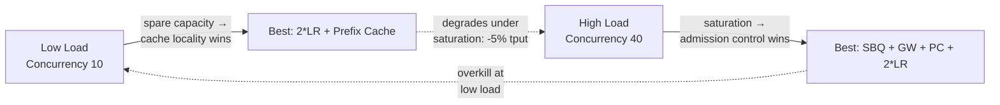
```mermaid
flowchart LR
    A["Low Load<br/>Concurrency 10"] -->|spare capacity →<br/>cache locality wins| B["Best: 2*LR + Prefix Cache"]
    C["High Load<br/>Concurrency 40"] -->|saturation →<br/>admission control wins| D["Best: SBQ + GW + PC + 2*LR"]
    B -.->|degrades under<br/>saturation: -5% tput| C
    D -.->|overkill at<br/>low load| A
```

| Aspect                     | Low Load (C=10)             | High Load (C=40)                    |
| -------------------------- | --------------------------- | ----------------------------------- |
| Bottleneck                 | Routing quality (cache hit) | GPU saturation / queueing           |
| Best Kthena config         | **2\*LR + Prefix Cache**    | **SBQ + GW + PC + 2\*LR**           |
| Best vs llm-d (throughput) | +20.2% (vs Default)         | +22.5% (vs Prefix Cache)            |
| Best vs llm-d (latency)    | -16.4%                      | -31.2%                              |
| Best vs llm-d (TTFT p50)   | n/a (already sub-second)    | -40.1%                              |
| Decisive mechanism         | Prefix Cache routing        | Session Boost Queue + Graceful Wait |
| Notable trade-off          | none significant            | higher p99 TTFT, ~2.5% request drop |

> **Headline takeaway.** The *same simple* configuration that wins at low load (2\*LR + Prefix
> Cache) actually **falls behind llm-d at high load**. Sustained advantage under saturation
> requires Kthena's queue-aware mechanisms (**SBQ + Graceful Wait**), which lift throughput by
> **>22%** and cut latency/ITL by **>31%** precisely when the system is under the most stress.

## C.2 Why the Crossover Happens

- **Low load:** GPUs are not the bottleneck, so avoiding prompt recomputation (prefix cache
  hit) directly lowers TTFT and frees capacity. Simple weighted routing is enough.
- **High load:** Every pod is busy; naively routing for cache locality piles requests onto
  already-saturated pods. The win comes from **controlling admission** — holding a freed slot
  briefly (Graceful Wait) for the *same* session's next turn (warm cache), and boosting
  recently-active sessions (SBQ) so multi-turn conversations stay fast end-to-end.

## C.3 Throughput Across Both Regimes (Best Configs vs llm-d)

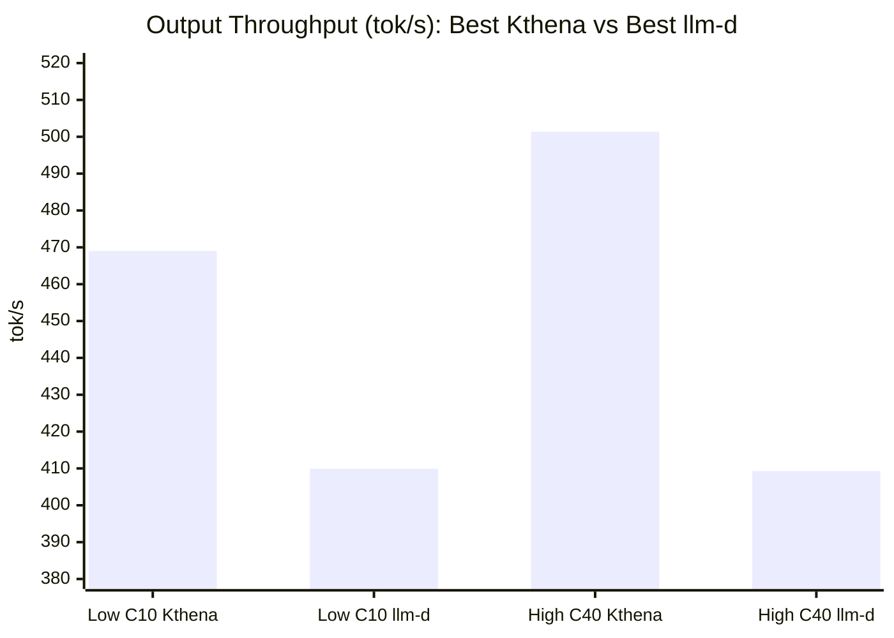
```mermaid
xychart-beta
    title "Output Throughput (tok/s): Best Kthena vs Best llm-d"
    x-axis ["Low C10 Kthena", "Low C10 llm-d", "High C40 Kthena", "High C40 llm-d"]
    y-axis "tok/s" 380 --> 520
    bar [469.01, 409.90, 501.37, 409.28]
```

---

## D. Configuration Recommendations

| Scenario / Goal                         | Recommended Configuration | Improvement vs llm-d                  |
| --------------------------------------- | ------------------------- | ------------------------------------- |
| **Low load, max throughput/TTFT**       | 2\*LR + Prefix Cache      | +20.2% tput, -14.7% TTFT (vs Default) |
| **Low load, lowest ITL**                | LR + KVCache Aware        | -17.6% ITL                            |
| **High load, max throughput**           | SBQ + GW + PC + 2\*LR     | +22.5% output throughput              |
| **High load, lowest avg latency/TTFT**  | SBQ + GW + SA + 2\*LR     | -31.4% latency, -24.5% TTFT           |
| **High load, best p50/p90 experience**  | SBQ + GW + PC + 2\*LR     | p50 TTFT -40.1%, p90 TTFT -75.8%      |
| **High load, 100% completion required** | 3\*KV + 2\*LR + 2\*GPU    | Latency -0.6%, ITL -3.1%, no drops    |
| **High load, lowest p99 TTFT/latency**  | 2\*LR + PC                | TTFT p99 -15.8%, Latency p99 -8.6%    |

---

## E. Conclusion

On a multi-turn conversation workload (AIPerf `basic`, 10 turns/conversation, 2,000 input
tokens/turn, 3 GPUs), **Kthena outperforms llm-d at both load levels — but via different
mechanisms**:

- **Low Load (C=10):** Prefix-cache-aware routing (**2\*LR + Prefix Cache**) delivers
  **+20% throughput, -16% latency, -15% TTFT, -16% ITL** and **~40% lower latency variance**
  than llm-d Default.

- **High Load (C=40):** Queue-aware scheduling (**SBQ + GW + PC + 2\*LR**) delivers
  **+22.5% throughput, -31.2% latency, -34.8% ITL, +44.9% tok/user**, with **p50 TTFT -40%**
  and **p90 TTFT -76%** vs llm-d Prefix Cache. The trade-off is higher p99 TTFT outliers and a
  ~2.5% request drop under extreme peak load; for strict completion guarantees,
  **3\*KV/3\*PC + 2\*LR + 2\*GPU** still beat llm-d without any drops.

The central finding: **the right routing strategy is load-dependent.** Simple weighted routing
maximizes cache locality when capacity is available, while **Session Boost Queue + Graceful
Wait** is essential to sustain — and even widen — Kthena's advantage once the cluster
saturates.

---

## Appendix — Prefix Cache Scoring Deep-Dive (Low Load, 1,000-request trace)

Analysis of `prefixcache.log` (per-request scoring) plus routing code for the
**2\*LR + Prefix Cache** configuration at concurrency 10.

**1. Overall statistics**

| Metric                                   | Value            |
| ---------------------------------------- | ---------------- |
| Total requests                           | 1,000            |
| Prefix cache hit (≥1 pod score > 0)      | 901 (90.1%)      |
| Prefix cache miss (all pods score 0)     | 99 (first turns) |
| Pod distribution (pod-3 / pod-4 / pod-5) | 335 / 325 / 340  |

**2. Weight behavior (LR weight = 2, Prefix weight = 1; max LR=200, max Prefix=100)**

- Prefix-preferred pod ultimately selected: **888/899 (98.8%)**
- LR-preferred pod selected: only 10 times — LR scores are usually too low to overcome Prefix.
- Most common LR score patterns: `[50,25,0]` 490× (49%), `[0,0,0]` 224× (22%),
  `[97-99,...,0]` ~160× (when a pod has waiting requests).
- Only when a pod has waiting requests (LR≈97-99 → ×2 = 194 > 100) can LR truly override Prefix.

**3. Core issue — prefix scores are binary (0 or 100)**

With `maxBlocksToMatch=128`, `blockSizeToHash=64`, only the first ~8,192 bytes (~2,000 tokens)
are hashed. With `INPUT_TOKENS_MEAN=2000`, the first turn already fills this cap, so from turn 2
onward each request's hashed prefix is **identical** to the prior turn's. Result: either 100%
match (same conversation's pod) or 0% (others). **In multi-turn mode the prefix cache degrades
into pure session affinity**, losing graded prefix-length scoring.

**4. Recommendations**

- For stronger LR influence: use **LR:Prefix = 3:1 or 4:1** so even a 1-request gap (LR=50→150)
  beats a prefix hit (100).
- To restore graded prefix scoring at large prompts: increase `maxBlocksToMatch` (more compute),
  or hash from the prompt **tail** (newest content) to distinguish turns.
- Current balance is already strong: 2\*LR + Prefix gives p50 TTFT≈216 ms, ~472 tok/s, with even
  pod distribution (335/325/340). The remaining optimization headroom is in enabling the prefix
  cache to emit gradient scores for smarter routing decisions.
