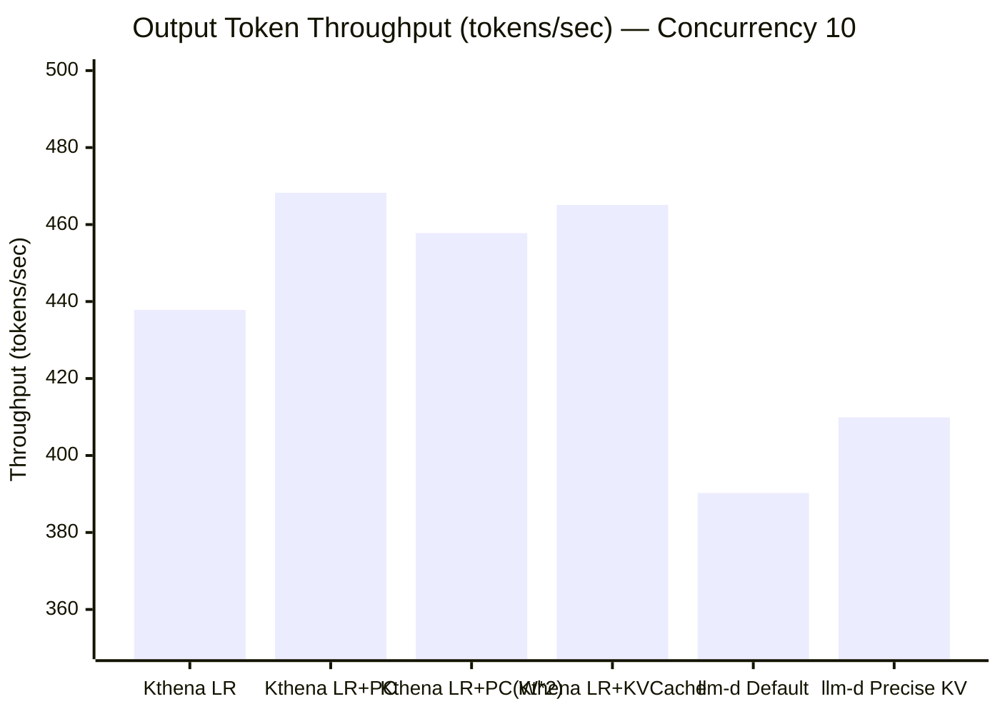
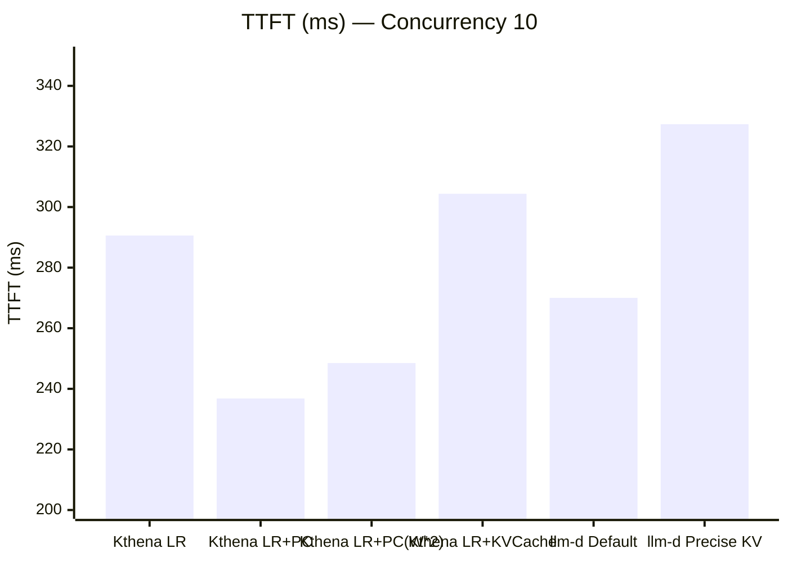
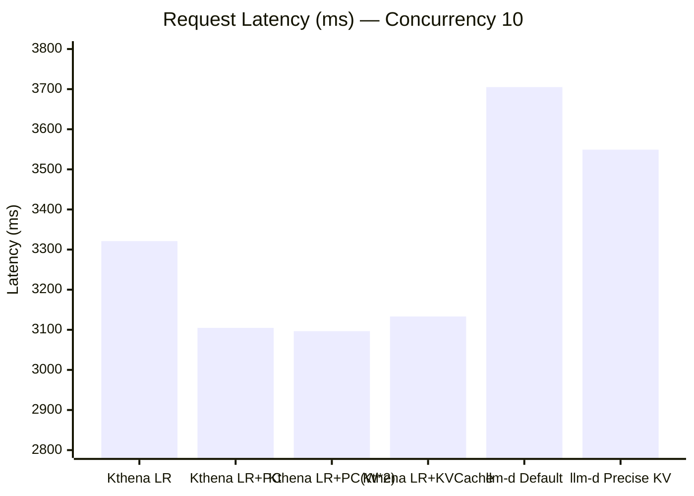
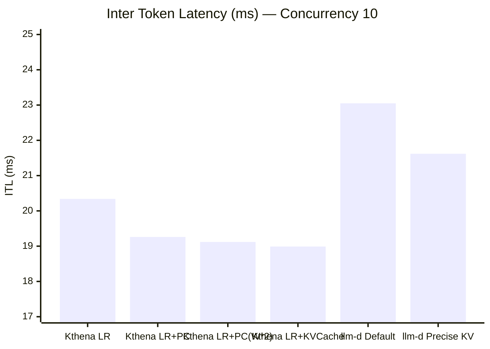
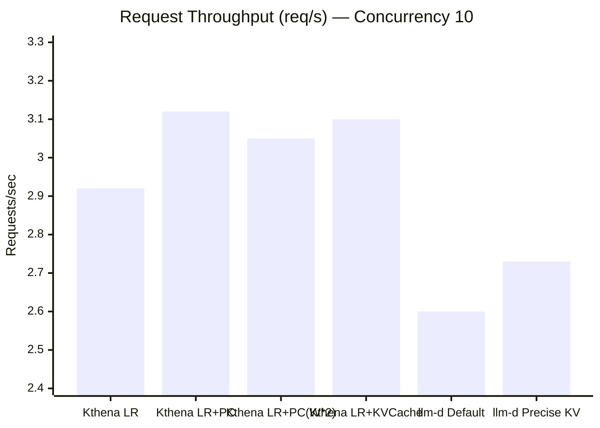
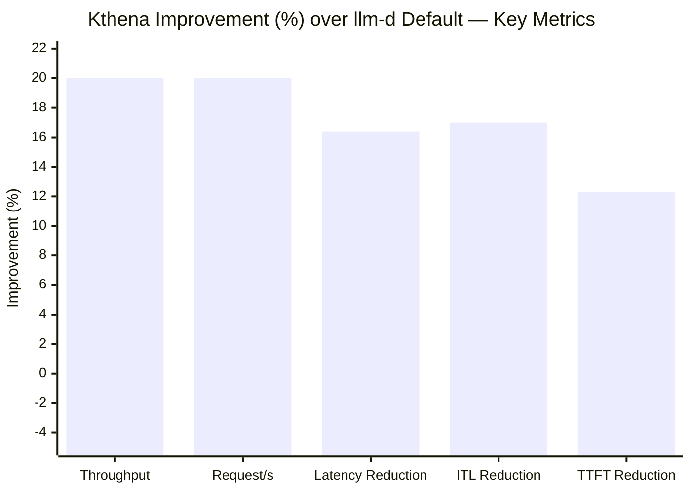

# Kthena vs llm-d Performance Benchmark Report

## 1. Test Environment & Methodology

**Workload:** Multi-turn conversation  
**Model:** LLM inference serving  
**Benchmark Tool:** NVIDIA AIPerf  
**Request Count:** 1,000 requests per run (3 runs per configuration, averaged)

| Parameter          | Value                            |
| ------------------ | -------------------------------- |
| Conversation Count | 100                              |
| Turn Mean          | 10                               |
| Input Tokens Mean  | 2,000                            |
| Concurrency        | 10 (primary), 20 (supplementary) |

**Configurations Tested:**

| System | Configuration            | Description                                              |
| ------ | ------------------------ | -------------------------------------------------------- |
| Kthena | Least Request (LR)       | Basic load balancing without cache optimization          |
| Kthena | LR + Prefix Cache        | Prefix-cache-aware routing with default weight           |
| Kthena | LR + Prefix Cache (W\*2) | Prefix-cache-aware routing with doubled weight           |
| Kthena | LR + KVCache Aware       | KV-cache-aware routing combining load and cache affinity |
| llm-d  | Default                  | Default routing strategy                                 |
| llm-d  | Precise KV Cache         | KV-cache-aware routing                                   |

---

## 2. Summary of Results (Concurrency = 10)

All values are **averages across 3 runs**. Lower is better for latency metrics; higher is better for throughput metrics.

| Configuration                       | TTFT (ms) | Request Latency (ms) | ITL (ms) | Output Throughput (tok/s) | Request Throughput (req/s) | Per-User Throughput (tok/s/user) |
| ----------------------------------- | --------- | -------------------- | -------- | ------------------------- | -------------------------- | -------------------------------- |
| **Kthena LR**                       | 290.60    | 3,321.11             | 20.34    | 437.83                    | 2.92                       | 54.75                            |
| **Kthena LR + Prefix Cache**        | 236.82    | 3,104.78             | 19.26    | 468.26                    | 3.12                       | 58.85                            |
| **Kthena LR + Prefix Cache (W\*2)** | 248.49    | 3,096.63             | 19.12    | 457.77                    | 3.05                       | 59.36                            |
| **Kthena LR + KVCache Aware**       | 304.39    | 3,133.19             | 18.99    | 465.10                    | 3.10                       | 60.26                            |
| **llm-d Default**                   | 270.03    | 3,705.12             | 23.05    | 390.26                    | 2.60                       | 58.81                            |
| **llm-d Precise KV Cache**          | 327.33    | 3,549.10             | 21.62    | 409.90                    | 2.73                       | 59.24                            |

---

## 3. Head-to-Head Comparison Charts

### 3.1 Output Token Throughput (tokens/sec) — Higher is Better

### 3.2 Time to First Token / TTFT (ms) — Lower is Better

### 3.3 Request Latency (ms) — Lower is Better

### 3.4 Inter Token Latency / ITL (ms) — Lower is Better

### 3.5 Request Throughput (req/s) — Higher is Better

---

## 4. Kthena Advantage Analysis

### 4.1 Percentage Improvement — Kthena over llm-d

The table below shows the percentage improvement of each Kthena configuration over each llm-d configuration. For latency metrics, improvement = reduction; for throughput metrics, improvement = increase.

#### vs. llm-d Default

| Metric                 | Kthena LR     | Kthena LR+PC | Kthena LR+PC(W\*2) | Kthena LR+KVCache |
| ---------------------- | ------------- | ------------ | ------------------ | ----------------- |
| **Output Throughput**  | **+12.2%**    | **+20.0%**   | **+17.3%**         | **+19.2%**        |
| **Request Throughput** | **+12.3%**    | **+20.0%**   | **+17.3%**         | **+19.2%**        |
| **Request Latency**    | **-10.4%**    | **-16.2%**   | **-16.4%**         | **-15.4%**        |
| **ITL**                | **-11.8%**    | **-16.4%**   | **-17.0%**         | **-17.6%**        |
| **TTFT**               | +7.6% (worse) | **-12.3%**   | **-8.0%**          | +12.7% (worse)    |

#### vs. llm-d Precise KV Cache

| Metric                 | Kthena LR  | Kthena LR+PC | Kthena LR+PC(W\*2) | Kthena LR+KVCache |
| ---------------------- | ---------- | ------------ | ------------------ | ----------------- |
| **Output Throughput**  | **+6.8%**  | **+14.2%**   | **+11.7%**         | **+13.5%**        |
| **Request Throughput** | **+7.0%**  | **+14.3%**   | **+11.7%**         | **+13.6%**        |
| **Request Latency**    | **-6.4%**  | **-12.5%**   | **-12.7%**         | **-11.7%**        |
| **ITL**                | **-5.9%**  | **-10.9%**   | **-11.6%**         | **-12.2%**        |
| **TTFT**               | **-11.2%** | **-27.6%**   | **-24.1%**         | **-7.0%**         |

> The chart above shows the **best Kthena configuration** improvement for each metric compared to llm-d Default.

---

## 5. Key Findings — Where Kthena Excels

### 5.1 Throughput: Up to +20% Higher

**Kthena LR + Prefix Cache** achieves **468.26 tokens/sec**, compared to llm-d Default's **390.26 tokens/sec** — a **+20.0% improvement** in output token throughput.

Even Kthena's baseline (Least Request without any cache optimization) delivers **437.83 tokens/sec**, which is **+12.2% higher** than llm-d Default.

Against llm-d's best configuration (Precise KV Cache at 409.90 tokens/sec), Kthena LR + Prefix Cache still leads by **+14.2%**.

### 5.2 Request Latency: Up to 16.4% Lower

**Kthena LR + Prefix Cache (W\*2)** achieves the lowest average request latency at **3,096.63 ms**, compared to llm-d Default's **3,705.12 ms** — a **16.4% reduction**.

All four Kthena configurations deliver request latency below **3,350 ms**, while both llm-d configurations exceed **3,500 ms**.

### 5.3 Inter Token Latency (ITL): Up to 17.6% Lower

**Kthena LR + KVCache Aware** achieves an average ITL of **18.99 ms**, compared to llm-d Default's **23.05 ms** — a **17.6% reduction**. This translates to noticeably smoother token streaming for end users.

All Kthena configurations keep ITL below **20.5 ms**, while llm-d Default runs at **23.05 ms** and llm-d Precise KV at **21.62 ms**.

### 5.4 TTFT: Up to 27.6% Lower (with Prefix Cache)

**Kthena LR + Prefix Cache** achieves a TTFT of **236.82 ms**, compared to llm-d Precise KV Cache's **327.33 ms** — a **27.6% reduction**. This is the single largest improvement observed in the benchmark.

Against llm-d Default (270.03 ms), Kthena LR + Prefix Cache still delivers a **12.3% reduction** in TTFT.

> **Note:** Without prefix cache optimization, Kthena's TTFT (290.60 ms for LR, 304.39 ms for KVCache Aware) is slightly higher than llm-d Default (270.03 ms). The advantage emerges specifically when prefix cache routing is enabled.

### 5.5 Latency Consistency: Lower Standard Deviation

Kthena configurations show significantly lower standard deviation in request latency, indicating more predictable performance:

| Configuration                   | Latency Std Dev (ms) |
| ------------------------------- | -------------------- |
| Kthena LR                       | 1,049.46             |
| Kthena LR + Prefix Cache        | 1,002.54             |
| Kthena LR + Prefix Cache (W\*2) | 988.30               |
| Kthena LR + KVCache Aware       | 1,076.22             |
| llm-d Default                   | 1,770.69             |
| llm-d Precise KV Cache          | 1,560.23             |

Kthena's latency variance is **~40-44% lower** than llm-d Default, meaning more consistent user experience with fewer tail-latency outliers.

---

## 6. Tail Latency Comparison (p99)

| Metric                   | Best Kthena (LR+PC) | llm-d Default | llm-d Precise KV | Kthena Improvement vs llm-d Default |
| ------------------------ | ------------------- | ------------- | ---------------- | ----------------------------------- |
| TTFT p99 (ms)            | ~625                | ~749          | ~902             | **-16.6%**                          |
| Request Latency p99 (ms) | ~5,472              | ~7,637        | ~7,352           | **-28.4%**                          |
| ITL p99 (ms)             | ~34.07              | ~47.88        | ~45.28           | **-28.8%**                          |

> Kthena shows dramatically better tail latency behavior — **p99 request latency is ~28% lower** and **p99 ITL is ~29% lower** than llm-d Default.

---

## 7. Concurrency 20 Results (Kthena Only)

At higher concurrency (20), only Kthena configurations were tested. These results demonstrate Kthena's scaling behavior:

| Configuration                 | TTFT (ms) | Latency (ms) | ITL (ms) | Throughput (tok/s) | Req/s |
| ----------------------------- | --------- | ------------ | -------- | ------------------ | ----- |
| **Kthena LR + KVCache Aware** | 501.28    | 5,480.82     | 33.43    | 513.72             | 3.43  |
| **Kthena LR + Prefix Cache**  | 479.71    | 6,029.46     | 37.26    | 481.66             | 3.21  |

Kthena sustains **513.72 tokens/sec** at concurrency 20 with KVCache Aware routing — **+31.6% higher** than llm-d Default at concurrency 10 (390.26 tokens/sec), indicating strong scaling characteristics.

---

## 8. Best Configuration Recommendations

| Optimization Goal                    | Best Kthena Config       | Improvement vs llm-d Default           |
| ------------------------------------ | ------------------------ | -------------------------------------- |
| **Maximum Throughput**               | LR + Prefix Cache        | +20.0% output tokens/sec               |
| **Lowest TTFT**                      | LR + Prefix Cache        | -12.3% avg, -27.6% vs llm-d Precise KV |
| **Lowest ITL / Smoothest Streaming** | LR + KVCache Aware       | -17.6% ITL                             |
| **Lowest Request Latency**           | LR + Prefix Cache (W\*2) | -16.4%                                 |
| **Best Tail Latency (p99)**          | LR + Prefix Cache        | -28.4% request latency p99             |
| **Most Consistent Latency**          | LR + Prefix Cache (W\*2) | ~44% lower std dev                     |

---

## 9. Conclusion

Across all key LLM serving metrics, **Kthena consistently outperforms llm-d** in the multi-turn conversation workload at concurrency 10:

- **Output throughput:** Kthena delivers **12–20% higher throughput** depending on configuration, with the best result from LR + Prefix Cache at **468.26 tokens/sec** (vs. llm-d's best of 409.90).
- **Request latency:** Kthena achieves **10–16% lower average latency** and **~28% lower p99 tail latency**, providing both faster and more predictable responses.
- **Inter token latency:** Kthena reduces ITL by **12–18%**, directly improving the perceived streaming speed for interactive users.
- **TTFT:** With prefix cache routing enabled, Kthena achieves **12–28% lower TTFT** than llm-d configurations, ensuring faster time-to-first-response.
- **Consistency:** Kthena's latency standard deviation is **~40–44% lower** than llm-d, indicating significantly more stable performance under load.

The strongest advantage scenario is **Kthena LR + Prefix Cache vs. llm-d Default**, where Kthena simultaneously achieves **+20% throughput, -16% latency, -12% TTFT, and -16% ITL**.
